# Class Diagram Reference

Class diagrams show object-oriented structures with classes, interfaces, and relationships.

## Basic Syntax

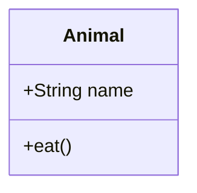

## Class Definition

### Inline Attributes

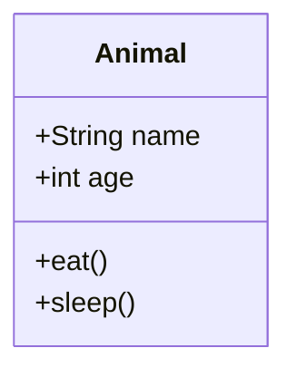

### Colon Syntax

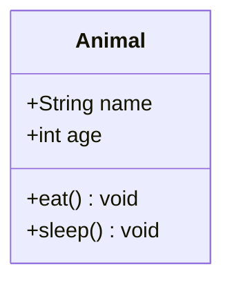

## Visibility Modifiers

| Symbol | Meaning |
|--------|---------|
| `+` | Public |
| `-` | Private |
| `#` | Protected |
| `~` | Package/Internal |

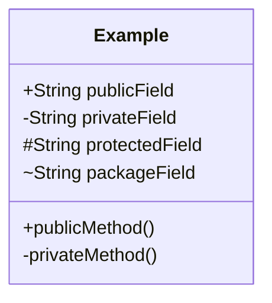

## Method Modifiers

### Abstract and Static

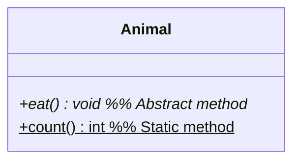

### Return Types

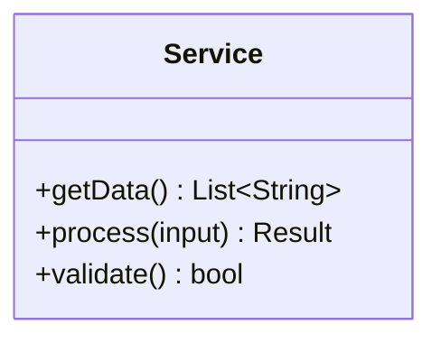

## Generic Types

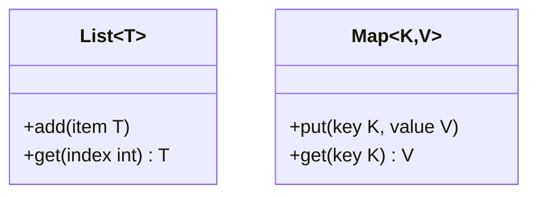

## Relationships

### Relationship Types

| Type | Syntax | Description |
|------|--------|-------------|
| Inheritance | `<\|--` | Class extends another |
| Composition | `*--` | Strong ownership |
| Aggregation | `o--` | Weak ownership |
| Association | `-->` | Uses/has reference |
| Dependency | `..>` | Depends on |
| Realization | `..\|>` | Implements interface |
| Link | `--` | Simple connection |

### Direction

Arrows can point either direction:

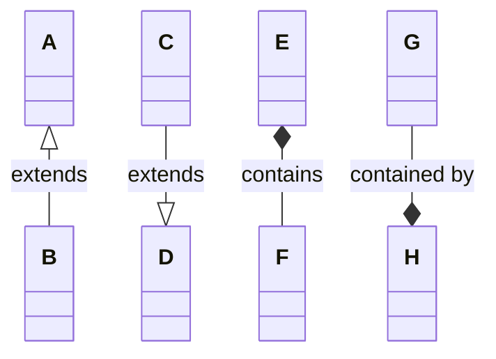

### Relationship Examples

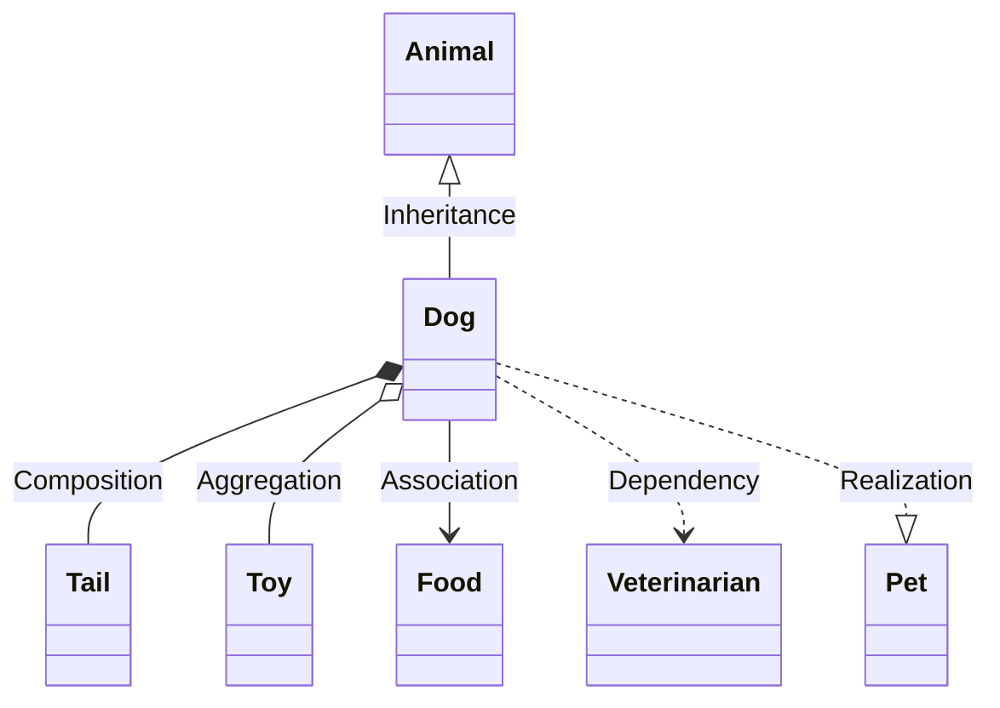

### Labels

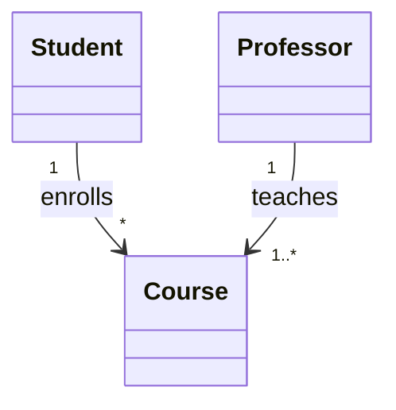

## Cardinality

| Notation | Meaning |
|----------|---------|
| `1` | Exactly one |
| `0..1` | Zero or one |
| `*` | Many (0 or more) |
| `1..*` | One or more |
| `n` | Fixed number |
| `0..n` | Zero to n |

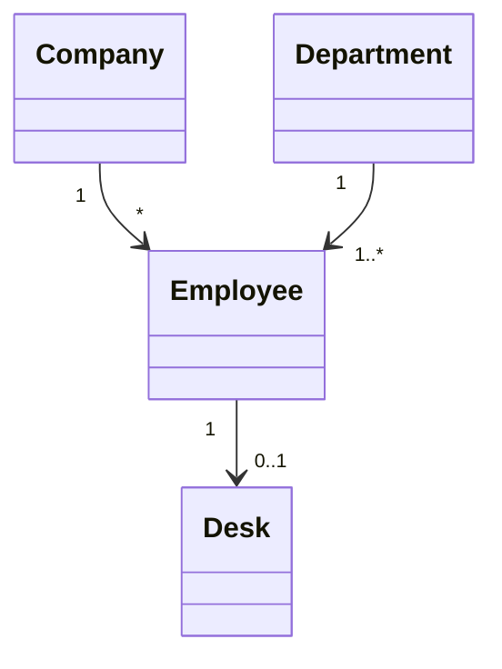

## Annotations

### Class Annotations

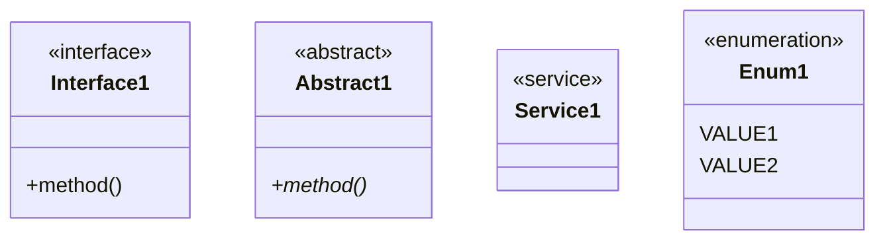

### Custom Annotations

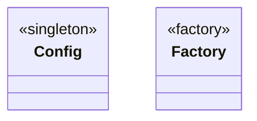

## Namespaces

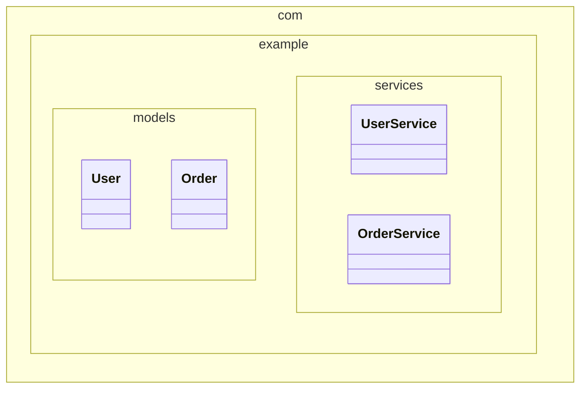

## Notes

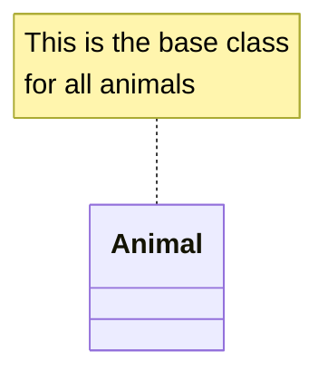

## Styling

### Style Individual Classes

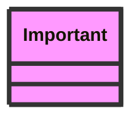

### CSS Classes

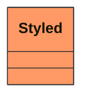

## Complete Example

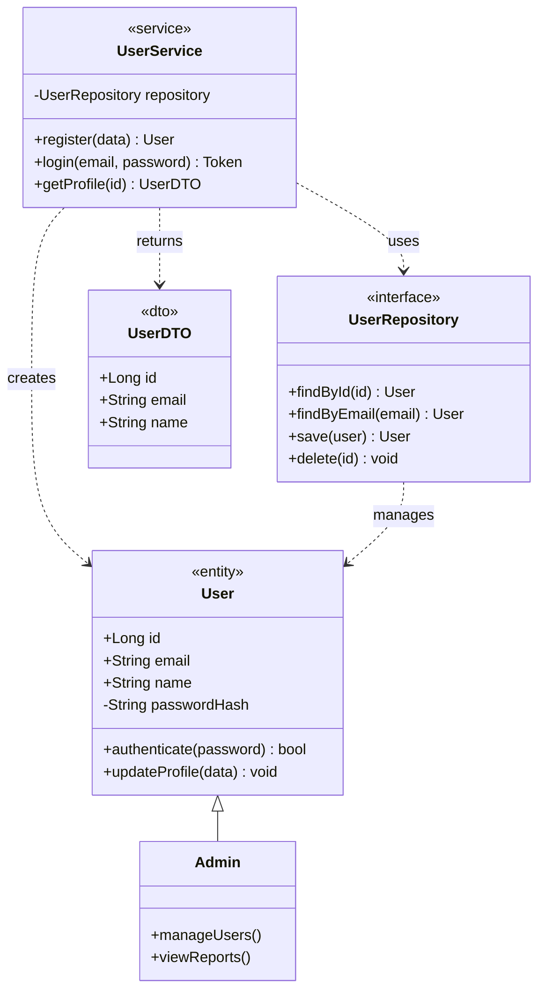

## Common Patterns

### Repository Pattern

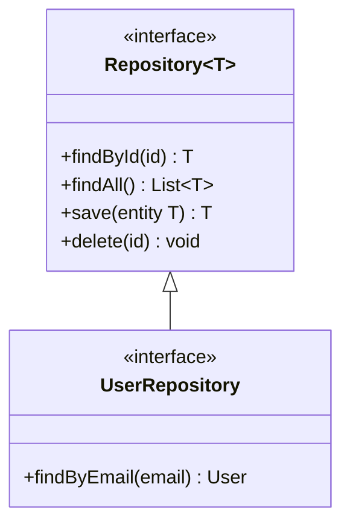

### Service Layer

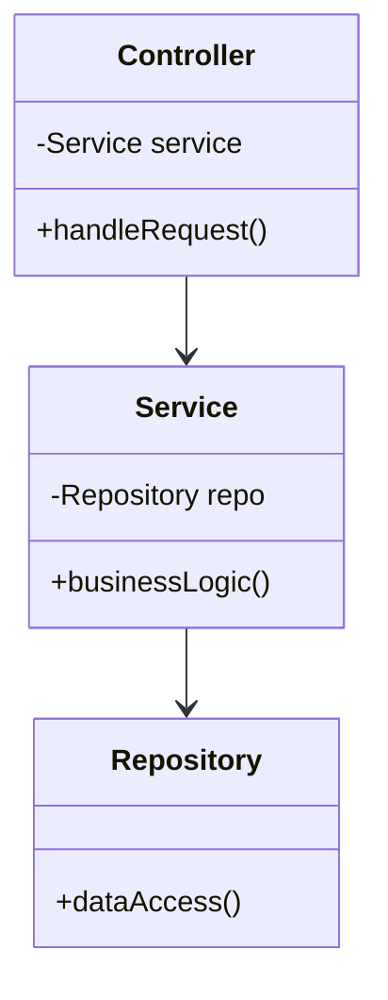

### Factory Pattern

```mermaid
classDiagram
    class Product {
        <<interface>>
        +operation()
    }
    class ConcreteProductA {
        +operation()
    }
    class ConcreteProductB {
        +operation()
    }
    class Factory {
        +createProduct(type) Product
    }

    Product <|.. ConcreteProductA
    Product <|.. ConcreteProductB
    Factory ..> Product : creates
```

### Decorator Pattern

```mermaid
classDiagram
    class Component {
        <<interface>>
        +operation()
    }
    class ConcreteComponent {
        +operation()
    }
    class Decorator {
        <<abstract>>
        -Component component
        +operation()
    }
    class ConcreteDecorator {
        +operation()
        +addedBehavior()
    }

    Component <|.. ConcreteComponent
    Component <|.. Decorator
    Decorator <|-- ConcreteDecorator
    Decorator o-- Component
```
