# Flowchart Reference

Flowcharts visualize processes, workflows, and decision trees.

## Basic Syntax

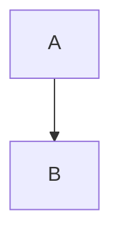

- `graph` or `flowchart` keyword starts the diagram
- Direction follows: `TD`, `TB`, `LR`, `RL`, `BT`

## Directions

| Direction | Meaning |
|-----------|---------|
| `TD` / `TB` | Top to bottom |
| `LR` | Left to right |
| `RL` | Right to left |
| `BT` | Bottom to top |

## Node Shapes

### Basic Shapes

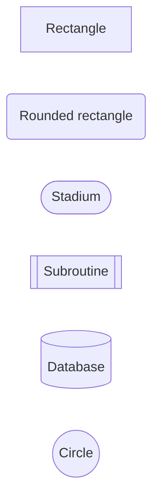

### Decision and Special

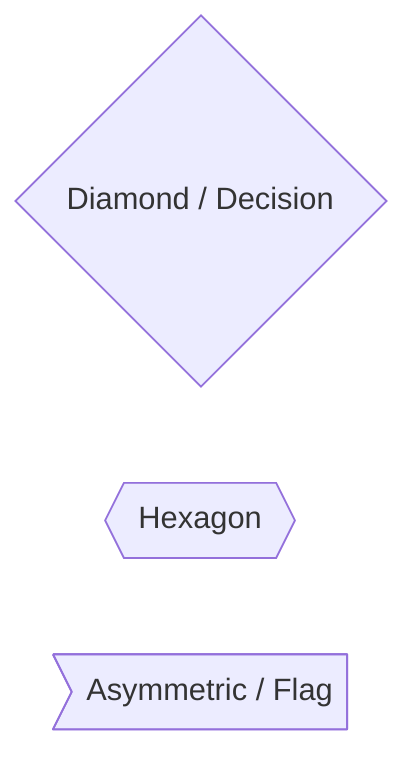

### Parallelograms and Trapezoids

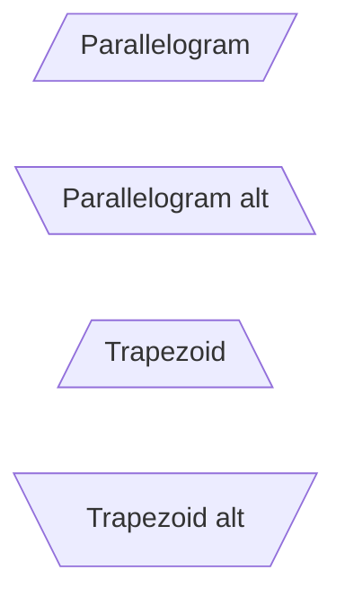

### Double Border

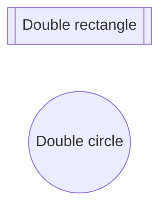

## Links / Edges

### Arrow Types

```mermaid
graph LR
    A --> B         %% Arrow
    B --- C         %% Open link
    C -.-> D        %% Dotted arrow
    D ==> E         %% Thick arrow
    E --o F         %% Circle end
    F --x G         %% Cross end
    G <--> H        %% Bidirectional
```

### Link Text

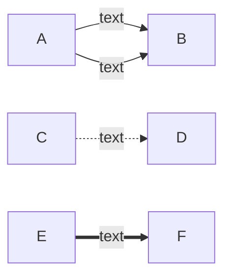

### Link Length

More dashes = longer link:

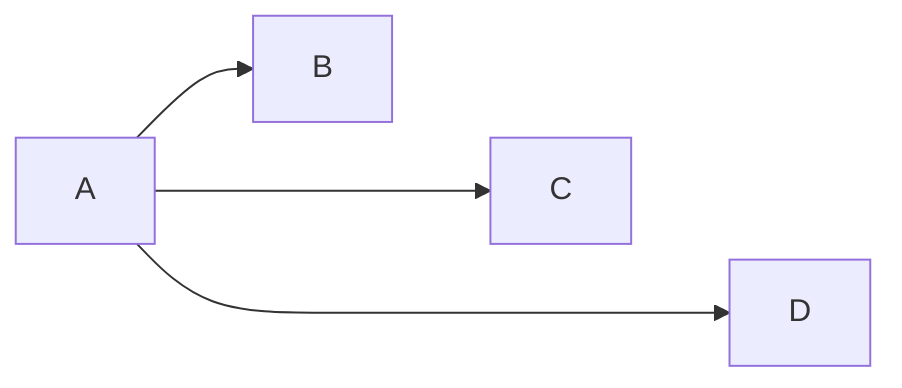

### Chaining

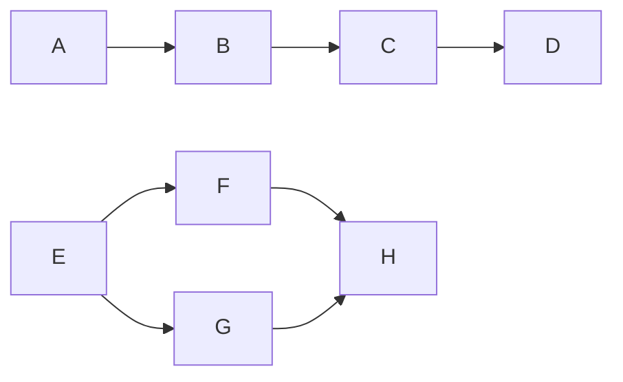

## Subgraphs

### Basic Subgraph

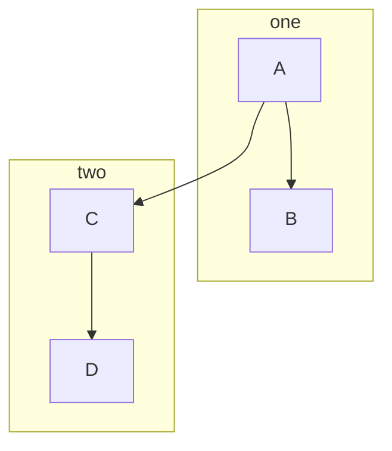

### Subgraph with Direction

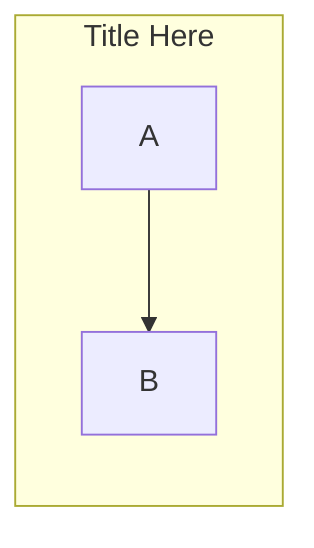

### Nested Subgraphs

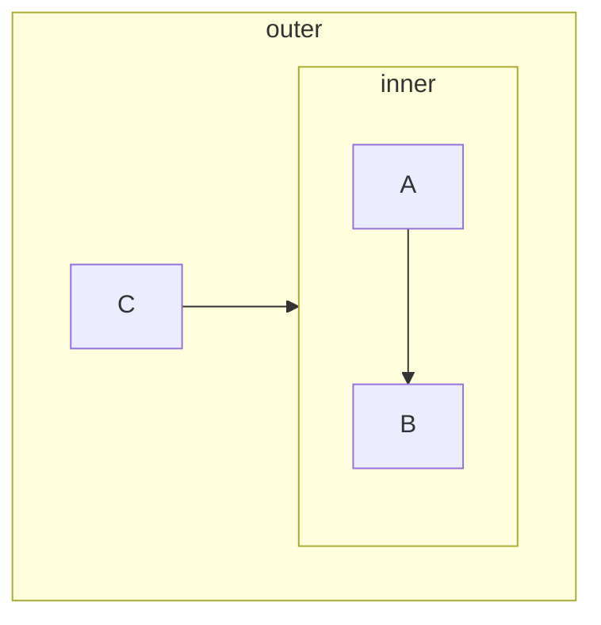

## Styling

### Style a Node

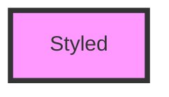

### Class Definitions

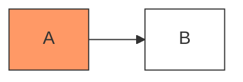

### Multiple Classes

```mermaid
graph LR
    A:::first:::second
    classDef first stroke:#f00
    classDef second fill:#0ff
```

### Style Properties

| Property | Description | Example |
|----------|-------------|---------|
| `fill` | Background color | `fill:#f96` |
| `stroke` | Border color | `stroke:#333` |
| `stroke-width` | Border width | `stroke-width:2px` |
| `stroke-dasharray` | Dashed border | `stroke-dasharray:5,5` |
| `color` | Text color | `color:#fff` |

### Link Styling

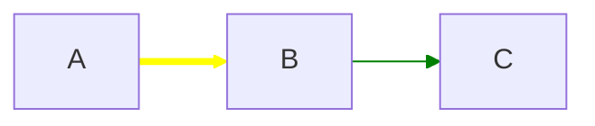

### Default Link Style

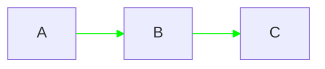

## Comments

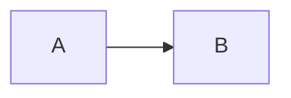

## Special Characters

### Quotes for Spaces

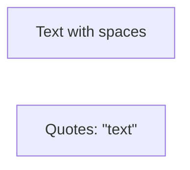

### Line Breaks

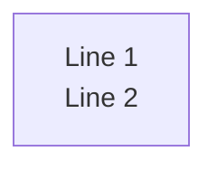

### Entity Codes

| Code | Character |
|------|-----------|
| `#quot;` | " |
| `#semi;` | ; |
| `#amp;` | & |
| `#lt;` | < |
| `#gt;` | > |

## Interactions (Click Events)

```mermaid
graph LR
    A --> B
    click A "https://example.com"
    click B callback "Tooltip text"
```

## Complete Example

```mermaid
flowchart TD
    subgraph Input
        A[User Request] --> B{Valid?}
    end

    subgraph Processing
        B -->|Yes| C[Process Data]
        B -->|No| D[Show Error]
        C --> E{Success?}
        E -->|Yes| F[Save Result]
        E -->|No| G[Log Error]
        G --> D
    end

    subgraph Output
        F --> H([Return Response])
        D --> I([Return Error])
    end

    style A fill:#9f9
    style D fill:#f99
    style H fill:#99f
    style I fill:#f99
```

## Common Patterns

### Decision Tree

```mermaid
graph TD
    A{Start} --> B{Condition 1?}
    B -->|Yes| C{Condition 2?}
    B -->|No| D[Action A]
    C -->|Yes| E[Action B]
    C -->|No| F[Action C]
```

### Pipeline

```mermaid
graph LR
    A[Input] --> B[Step 1] --> C[Step 2] --> D[Step 3] --> E[Output]
```

### Branching and Merging

```mermaid
graph TD
    A[Start] --> B{Branch?}
    B -->|Option 1| C[Path 1]
    B -->|Option 2| D[Path 2]
    C --> E[Merge]
    D --> E
    E --> F[End]
```
