# Timeline Reference

Timelines display chronological events and historical progressions.

## Basic Syntax

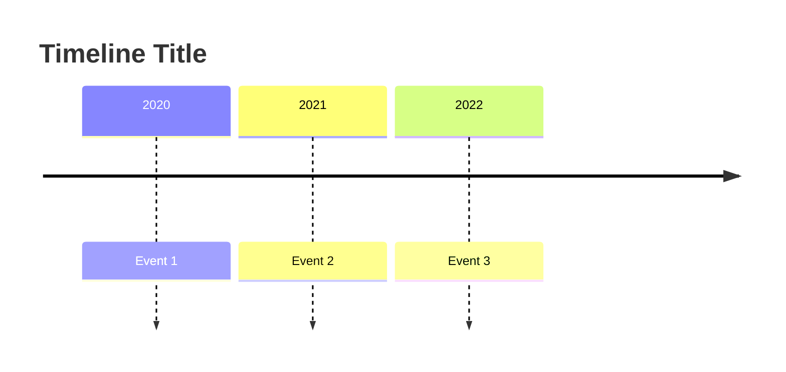

## Title

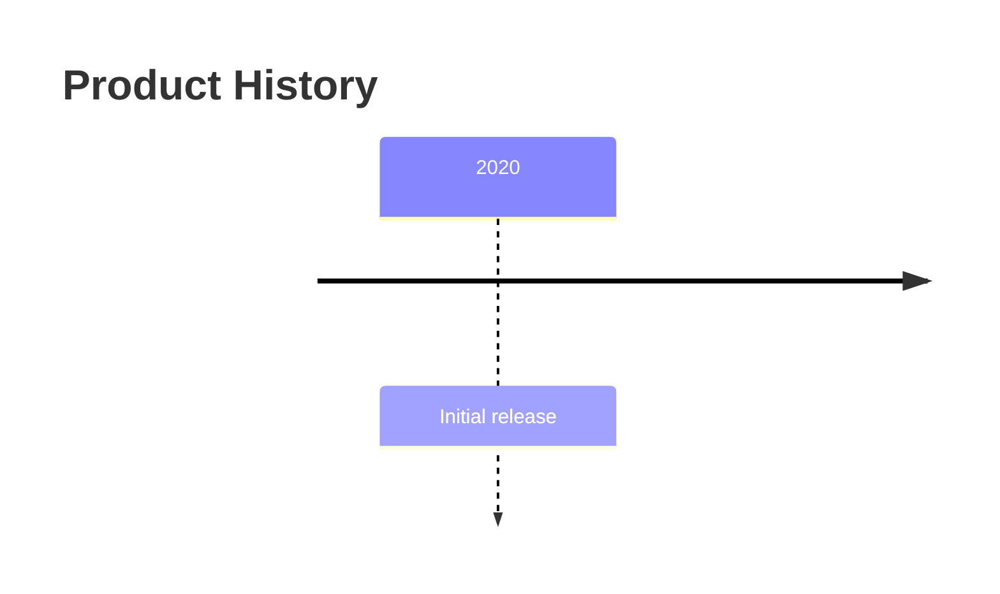

## Time Periods

### Years

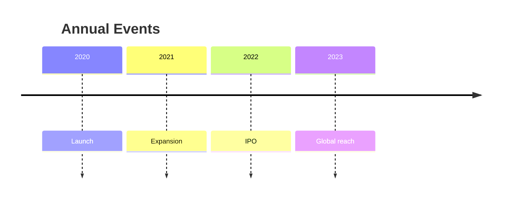

### Quarters

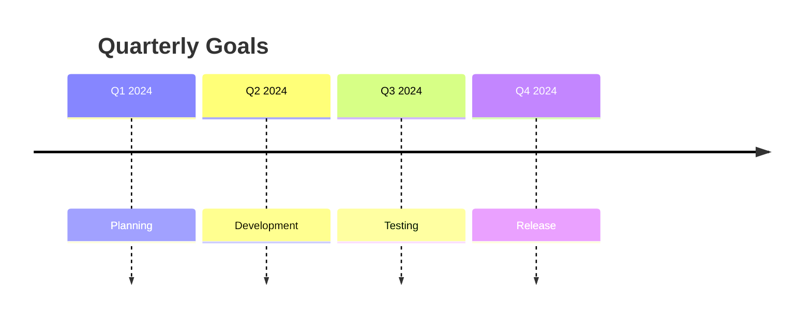

### Months

### Custom Periods

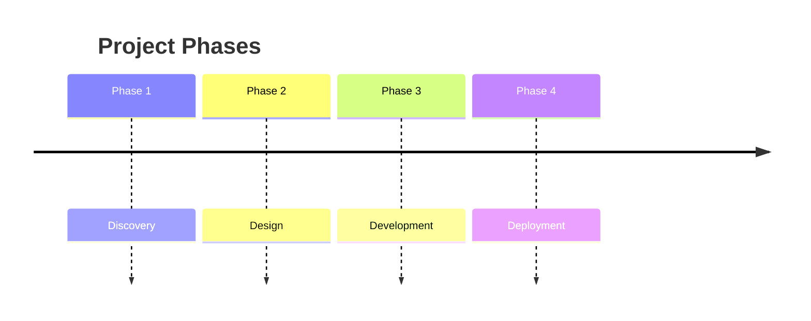

## Multiple Events

### Multiple Events per Period

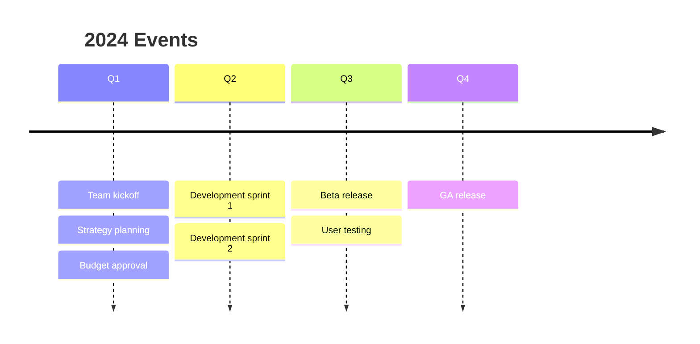

## Sections

### Section Grouping

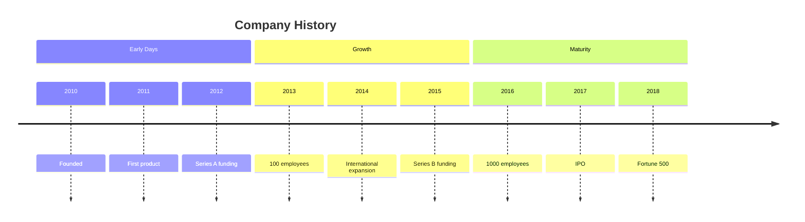

## Complete Examples

### Product Roadmap

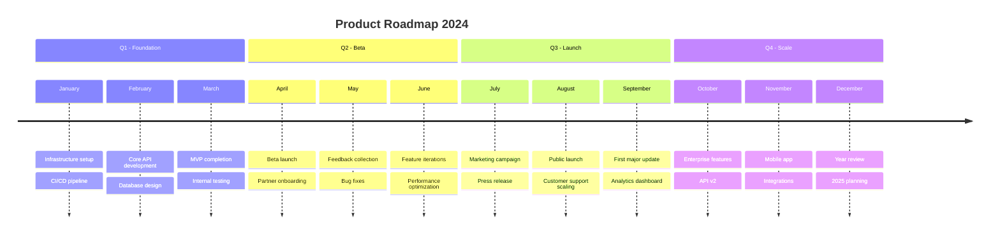

### Project Timeline

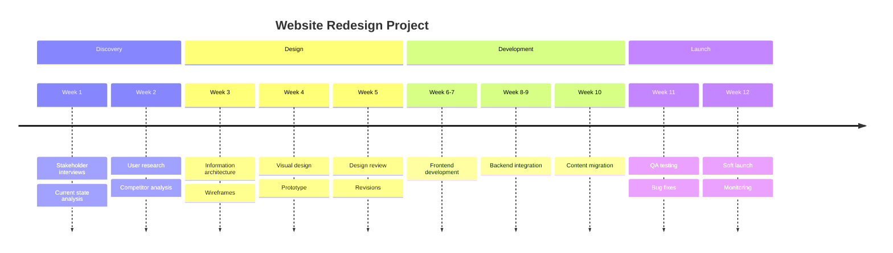

### Technology Evolution

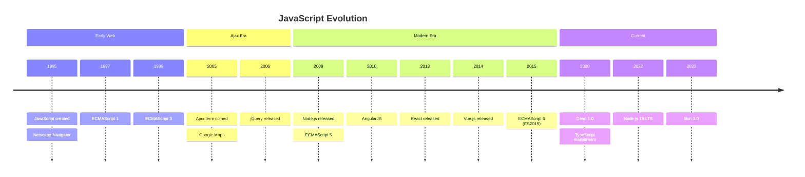

### Version History

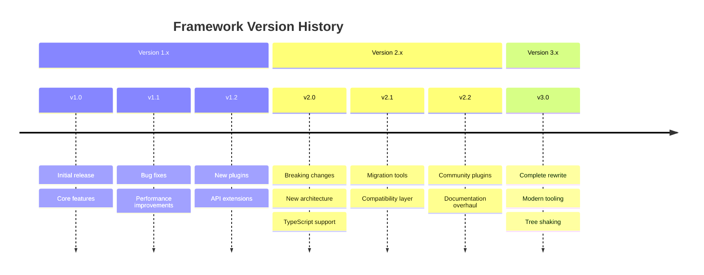

### Sprint History

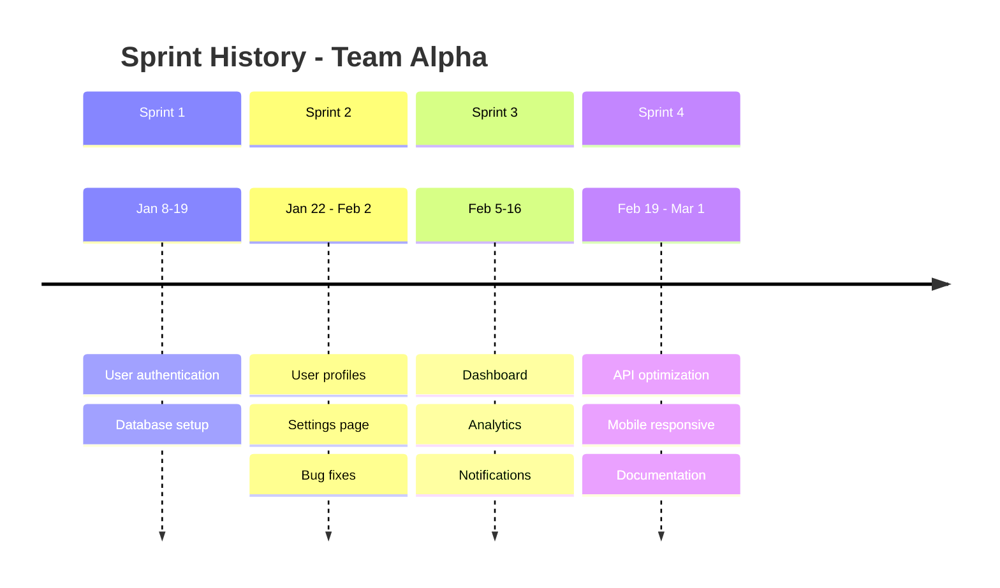

### Company Milestones

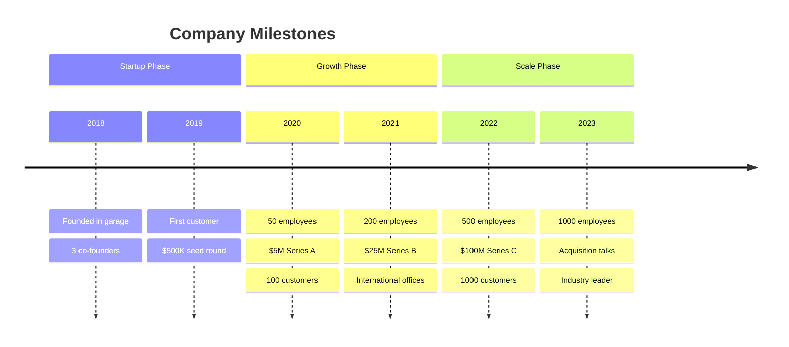

## Tips

1. **Keep It Simple**: Focus on key events, not every detail
2. **Consistent Periods**: Use consistent time increments
3. **Sections**: Group related time periods for clarity
4. **Multiple Events**: List related items under the same period
5. **Descriptive Labels**: Make events self-explanatory
6. **Chronological Order**: Maintain time sequence
7. **Balance**: Distribute events evenly when possible
