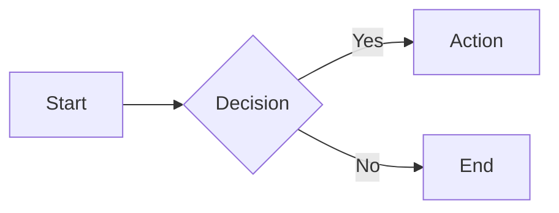
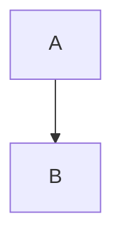
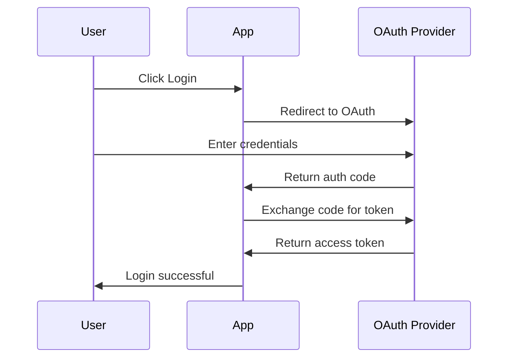
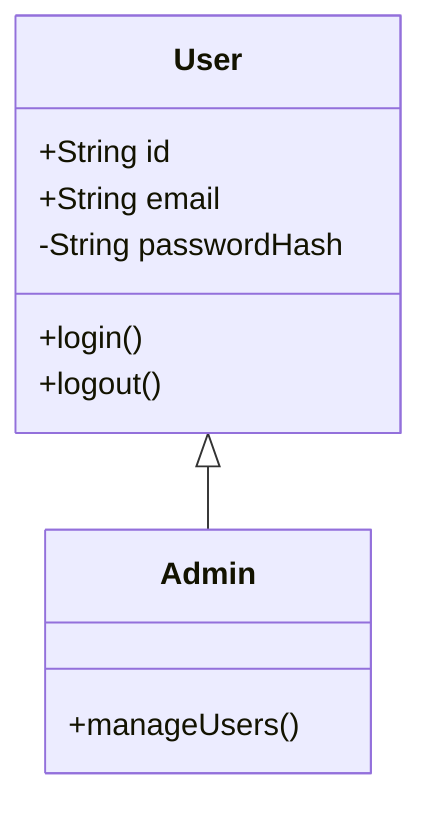

# Mermaid Diagramming Skill

Create diagrams as code using Mermaid syntax for documentation, architecture visualization, and technical communication.

## Quick Start

### Basic Flowchart



### Embed in Markdown

Wrap Mermaid code in fenced code blocks with `mermaid` language identifier:

````markdown

````

### Render to Image

```bash
# Render to PNG
python3 ~/.claude/skills/mermaid/scripts/render.py diagram.mmd -o diagram.png

# Render to SVG
python3 ~/.claude/skills/mermaid/scripts/render.py diagram.mmd -o diagram.svg --format svg
```

## Prerequisites

Requires mermaid-cli: `npm install -g @mermaid-js/mermaid-cli`

## Diagram Type Selection

Use this decision matrix to choose the right diagram type:

| Need | Diagram Type | Example Use Case |
|------|-------------|------------------|
| Show process flow | **Flowchart** | User registration, CI/CD pipeline |
| Show API/service interactions | **Sequence** | REST API calls, microservice communication |
| Show code structure | **Class Diagram** | OOP design, type relationships |
| Show data models | **ER Diagram** | Database schema, data relationships |
| Show system architecture | **C4 Diagram** | System context, containers, components |
| Show state transitions | **State Diagram** | Order status, authentication states |
| Show project timeline | **Gantt Chart** | Sprint planning, project milestones |
| Show historical events | **Timeline** | Product roadmap, version history |
| Show user experience | **User Journey** | Onboarding flow, customer experience |

## Workflows

### Description to Diagram

1. Identify the diagram type from the description
2. Extract entities/nodes and their relationships
3. Write Mermaid syntax
4. Validate syntax
5. Render if image output needed

**Example:**

User: "Show how a user logs in with OAuth"



### Code to Class Diagram

1. Analyze code structure (classes, interfaces, relationships)
2. Identify inheritance, composition, associations
3. Map visibility modifiers (+public, -private, #protected)
4. Generate class diagram syntax

**Example:**



### Documentation Integration

Embed diagrams directly in markdown files:

1. Add mermaid code block in README/docs
2. GitHub, GitLab, and many tools render automatically
3. For static sites, pre-render to images

### Render to Image

For platforms that don't support Mermaid natively:

```bash
# Single file
python3 ~/.claude/skills/mermaid/scripts/render.py input.mmd -o output.png

# Extract and render all diagrams from markdown
python3 ~/.claude/skills/mermaid/scripts/render.py README.md --batch -o diagrams/

# With custom theme
python3 ~/.claude/skills/mermaid/scripts/render.py input.mmd -o output.svg --theme dark
```

## Diagram Types

| Type | Syntax Start | Key Concepts | Reference |
|------|--------------|--------------|-----------|
| Flowchart | `graph TD` | Nodes, edges, subgraphs | `references/flowchart.md` |
| Sequence | `sequenceDiagram` | Participants, messages, loops | `references/sequence.md` |
| Class | `classDiagram` | Classes, relationships, visibility | `references/class-diagram.md` |
| State | `stateDiagram-v2` | States, transitions, composites | `references/state-diagram.md` |
| ER | `erDiagram` | Entities, relationships, cardinality | `references/er-diagram.md` |
| C4 | `C4Context` | Person, System, Container, Rel | `references/c4-diagram.md` |
| Gantt | `gantt` | Tasks, dependencies, milestones | `references/gantt.md` |
| Timeline | `timeline` | Periods, events, sections | `references/timeline.md` |
| User Journey | `journey` | Sections, tasks, scores | `references/user-journey.md` |

Quick syntax for all types: `references/quick-reference.md`

## Rendering Options

### Formats

| Format | Use Case | Command |
|--------|----------|---------|
| PNG | General use, presentations | `--format png` (default) |
| SVG | Scalable, web embedding | `--format svg` |
| PDF | Documents, printing | `--format pdf` |

### Themes

| Theme | Description |
|-------|-------------|
| `default` | Standard Mermaid theme |
| `dark` | Dark background |
| `forest` | Green tones |
| `neutral` | Grayscale |

```bash
python3 ~/.claude/skills/mermaid/scripts/render.py input.mmd -o out.png --theme dark
```

### Dimensions

```bash
# Custom width (height auto-scales)
python3 ~/.claude/skills/mermaid/scripts/render.py input.mmd -o out.png --width 1200

# Custom dimensions
python3 ~/.claude/skills/mermaid/scripts/render.py input.mmd -o out.png --width 1200 --height 800
```

### Background

```bash
# Transparent background (for PNG/SVG)
python3 ~/.claude/skills/mermaid/scripts/render.py input.mmd -o out.png --background transparent

# Custom color
python3 ~/.claude/skills/mermaid/scripts/render.py input.mmd -o out.png --background "#f0f0f0"
```

## Common Patterns

See `references/examples.md` for real-world patterns:
- API documentation (sequence diagrams)
- Database schemas (ER diagrams)
- CI/CD pipelines (flowcharts)
- Microservices architecture (C4 diagrams)
- Authentication flows (state diagrams)
- Project timelines (Gantt charts)

## Script Reference

### render.py

Render Mermaid diagrams to images.

```bash
# From file
python3 ~/.claude/skills/mermaid/scripts/render.py diagram.mmd -o output.png

# From inline code
python3 ~/.claude/skills/mermaid/scripts/render.py --inline "graph LR; A-->B" -o out.png

# From stdin
echo "graph LR; A-->B" | python3 ~/.claude/skills/mermaid/scripts/render.py --stdin -o out.png

# Batch mode (extract from markdown)
python3 ~/.claude/skills/mermaid/scripts/render.py README.md --batch -o diagrams/

# Options
--format png|svg|pdf    # Output format (default: png)
--theme default|dark|forest|neutral
--width 800             # Width in pixels
--height 600            # Height in pixels
--background "#ffffff"  # Background color
--config config.json    # Custom mermaid config
```

### validate.py

Validate Mermaid syntax without rendering.

```bash
# Validate file
python3 ~/.claude/skills/mermaid/scripts/validate.py diagram.mmd

# Validate inline
python3 ~/.claude/skills/mermaid/scripts/validate.py --inline "graph LR; A-->B"

# Validate all diagrams in markdown
python3 ~/.claude/skills/mermaid/scripts/validate.py README.md

# Exit codes
# 0 = valid
# 1 = syntax errors (with messages)
```

