# C4 Diagram Reference

C4 diagrams visualize software architecture at different levels of abstraction.

## C4 Model Levels

1. **Context** (Level 1) - System in its environment
2. **Container** (Level 2) - High-level tech decisions
3. **Component** (Level 3) - Components within containers
4. **Code** (Level 4) - Implementation details (use class diagrams)

## Context Diagram (C4Context)

Shows the system and its relationships with users and external systems.

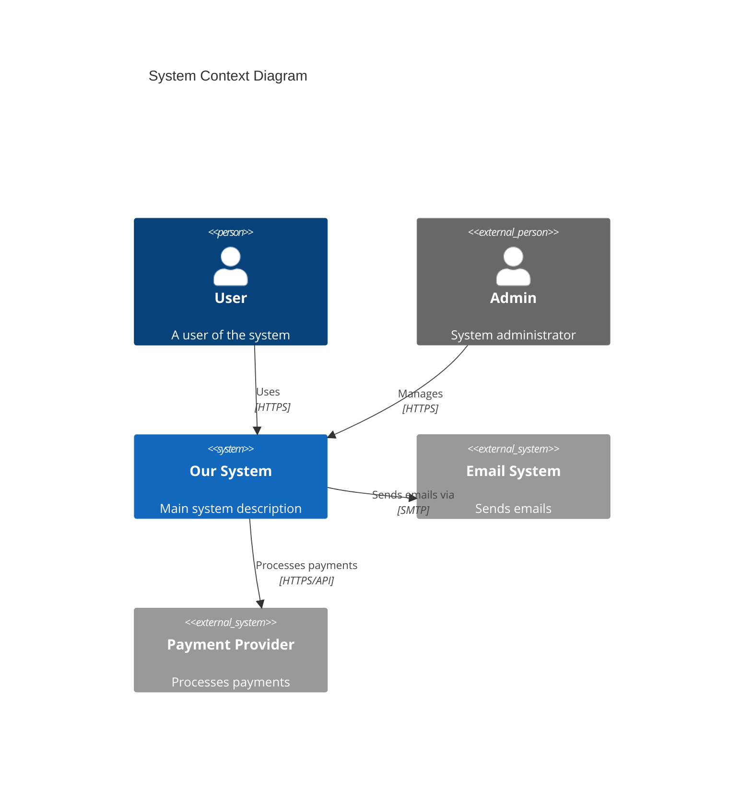

## Container Diagram (C4Container)

Shows the containers (applications, data stores) that make up the system.

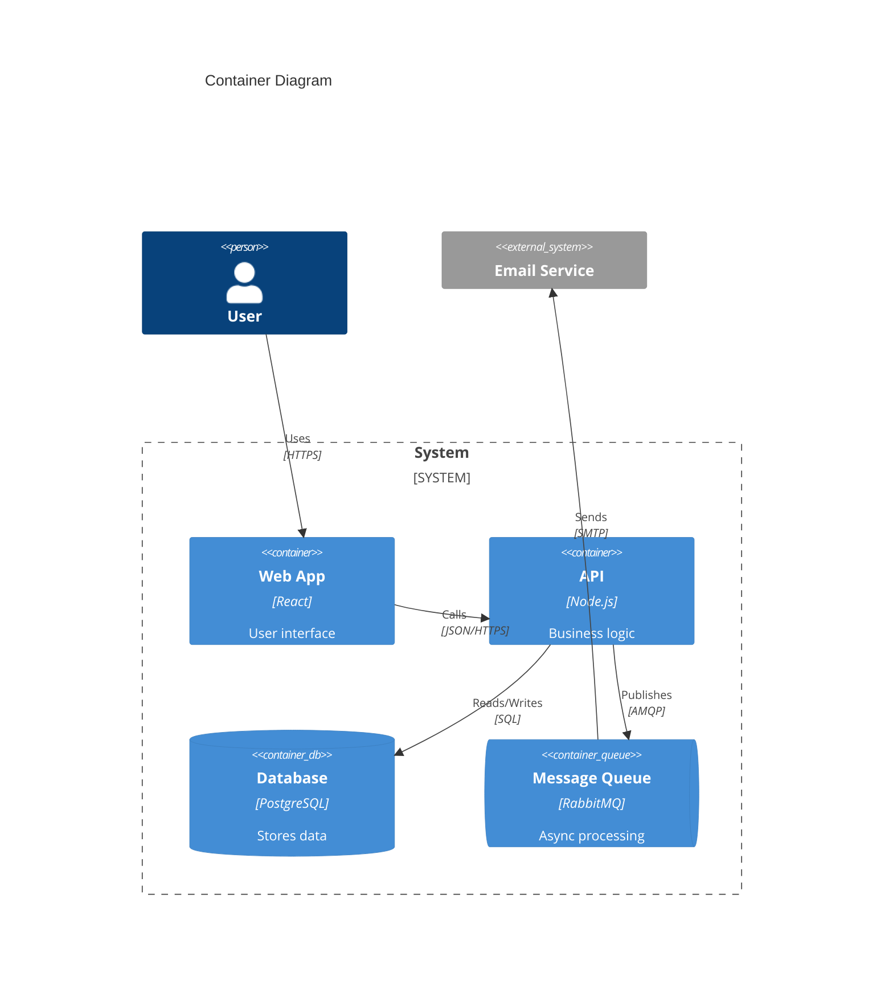

## Component Diagram (C4Component)

Shows the components within a container.

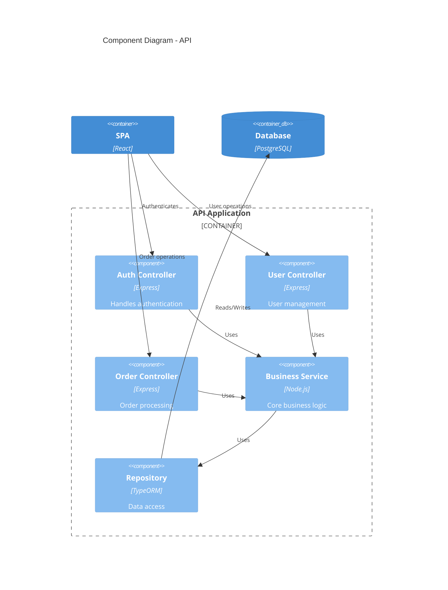

## Elements

### People

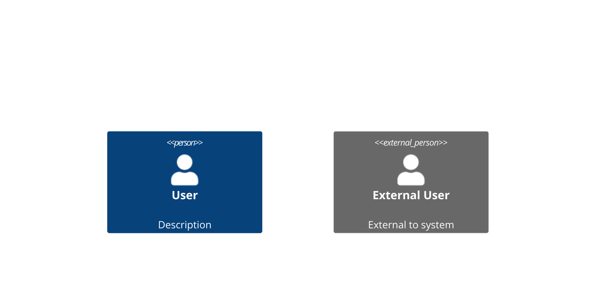

### Systems

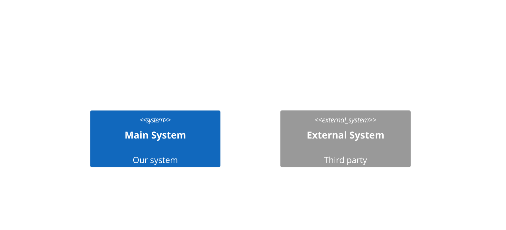

### Containers

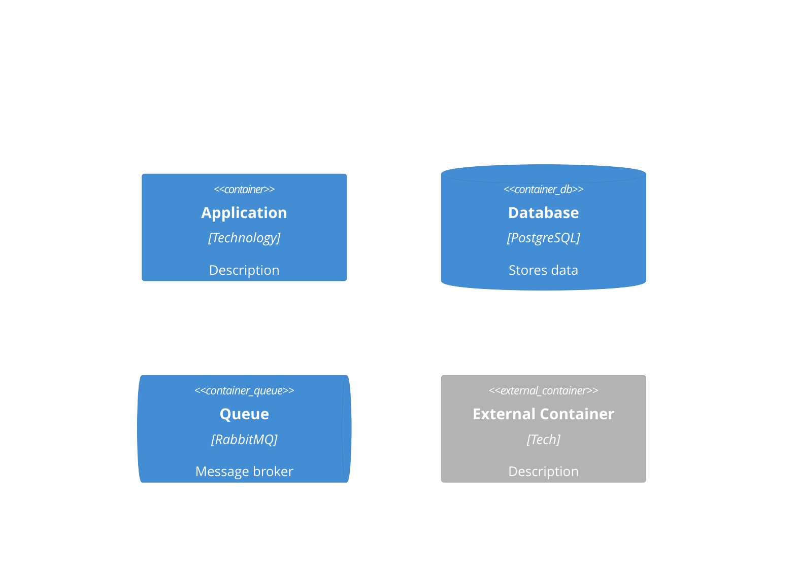

### Components

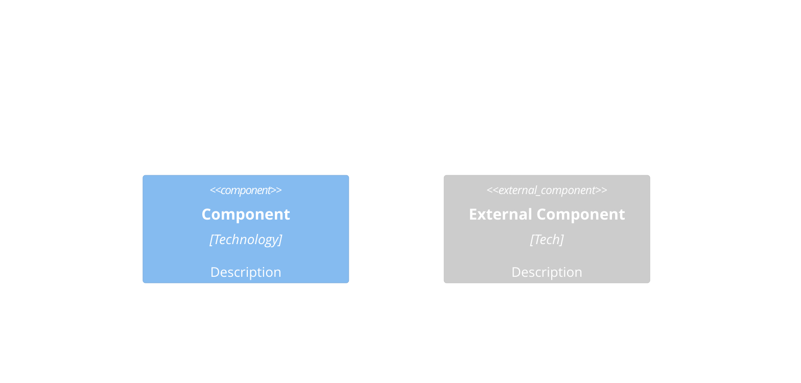

## Boundaries

### System Boundary


### Container Boundary

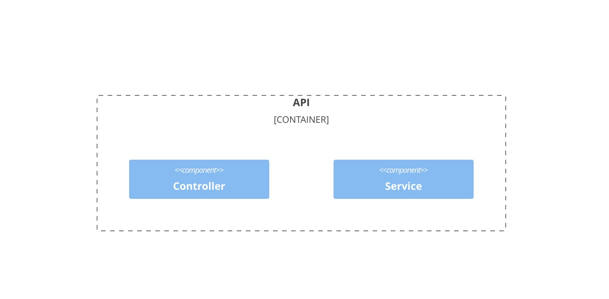

### Enterprise Boundary

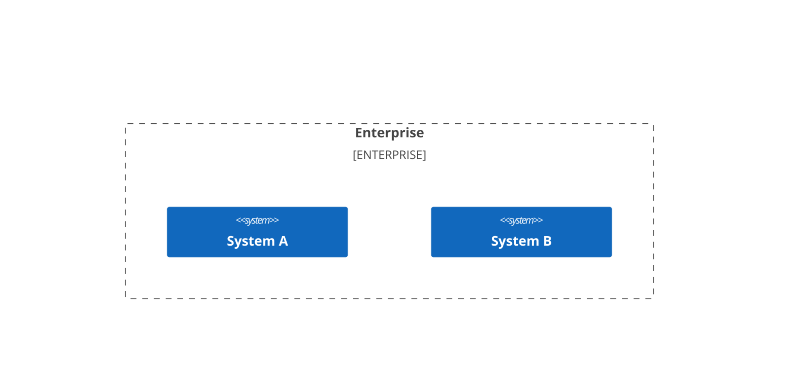

## Relationships

### Basic Relationships

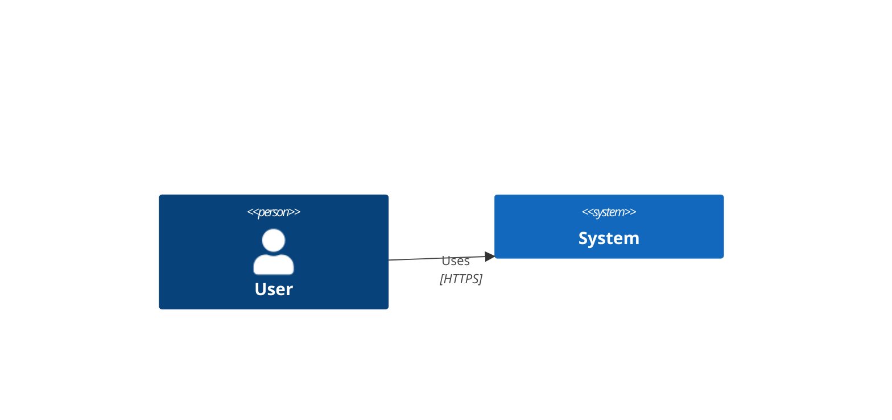

### Directional Relationships

```mermaid
C4Context
    System(a, "A")
    System(b, "B")
    System(c, "C")
    System(d, "D")

    Rel_U(a, b, "Up")        %% Upward
    Rel_D(a, c, "Down")      %% Downward
    Rel_L(a, d, "Left")      %% Left
    Rel_R(a, b, "Right")     %% Right
```

### Bidirectional

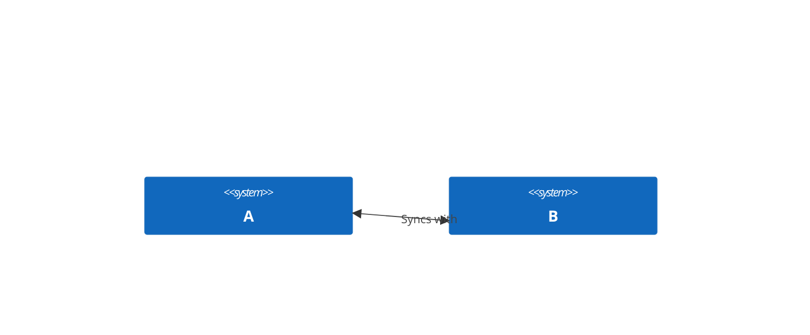

### Back Relationships


## Deployment Diagram

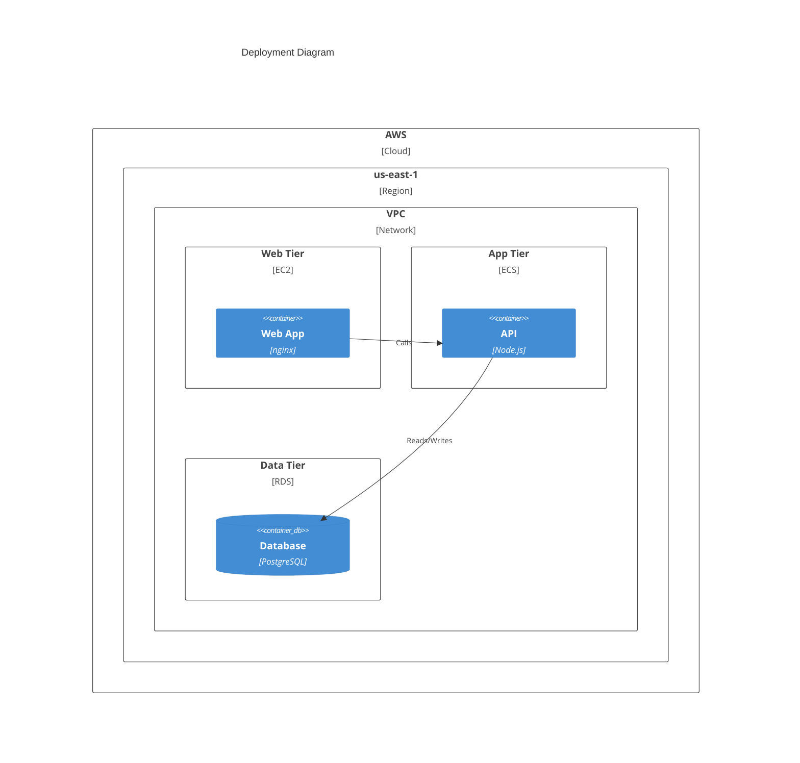

## Styling

### Update Element Style

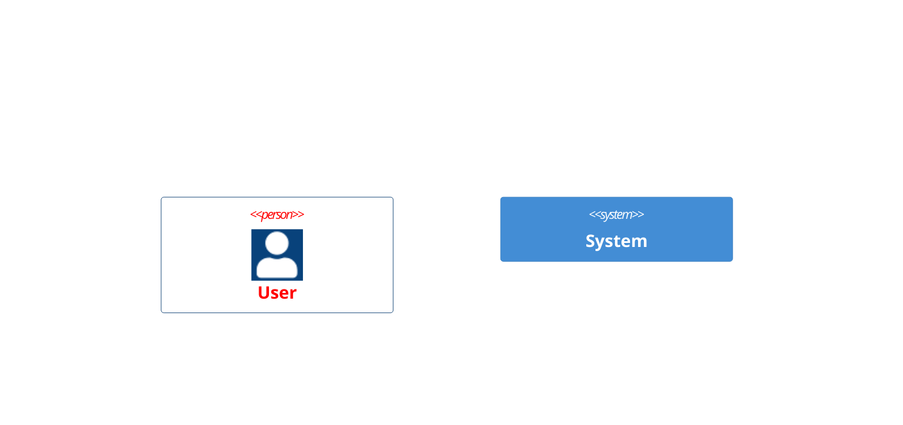

### Layout Direction

```mermaid
C4Context
    UpdateLayoutConfig($c4ShapeInRow="3", $c4BoundaryInRow="2")
```

## Complete Example

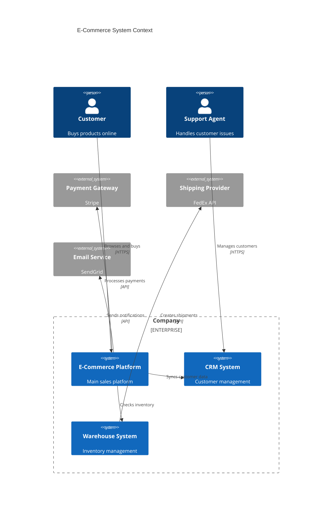

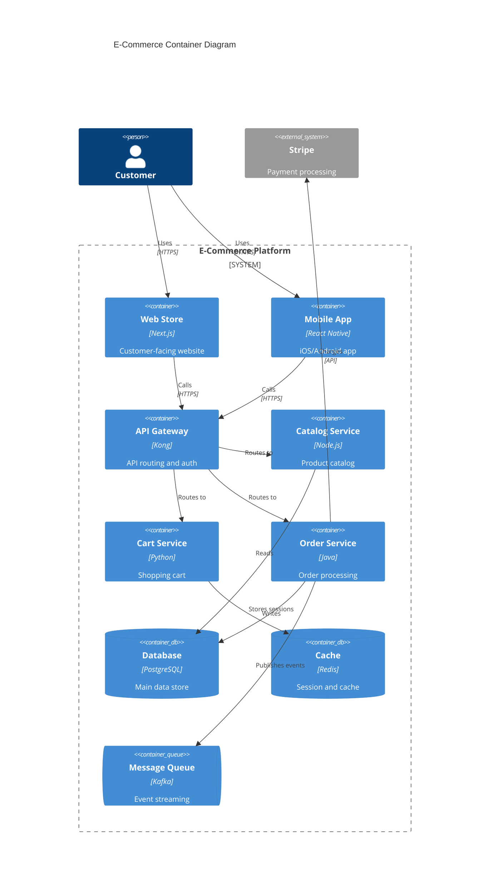

## Tips

1. **Start with Context**: Always begin with a Context diagram
2. **Zoom In**: Only add Container/Component diagrams where needed
3. **Keep It Simple**: 5-10 elements per diagram is ideal
4. **Consistent Naming**: Use clear, consistent names across diagrams
5. **Descriptions**: Add brief descriptions to elements
6. **Technology Labels**: Include technology choices in containers
7. **Show Key Flows**: Focus on important relationships
