# ER Diagram Reference

Entity-Relationship diagrams model database schemas and data relationships.

## Basic Syntax

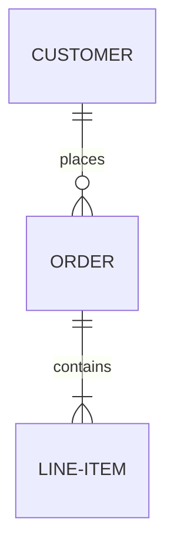

## Entities

### Simple Entity

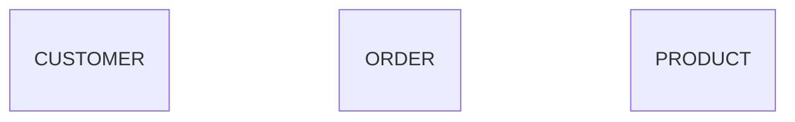

### Entity with Attributes

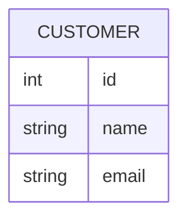

## Attribute Types

### Data Types

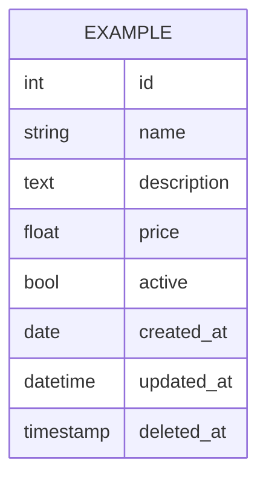

### Keys and Constraints

| Suffix | Meaning |
|--------|---------|
| `PK` | Primary Key |
| `FK` | Foreign Key |
| `UK` | Unique Key |

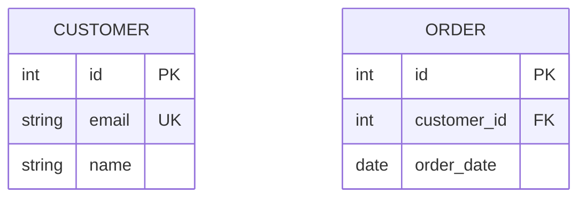

### Comments

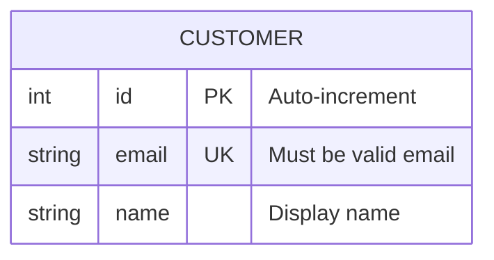

## Relationships

### Cardinality Notation

Left side (first entity):
| Symbol | Meaning |
|--------|---------|
| `\|\|` | Exactly one |
| `\|o` | Zero or one |
| `}o` | Zero or more |
| `}\|` | One or more |

Right side (second entity):
| Symbol | Meaning |
|--------|---------|
| `\|\|` | Exactly one |
| `o\|` | Zero or one |
| `o{` | Zero or more |
| `\|{` | One or more |

### Relationship Examples

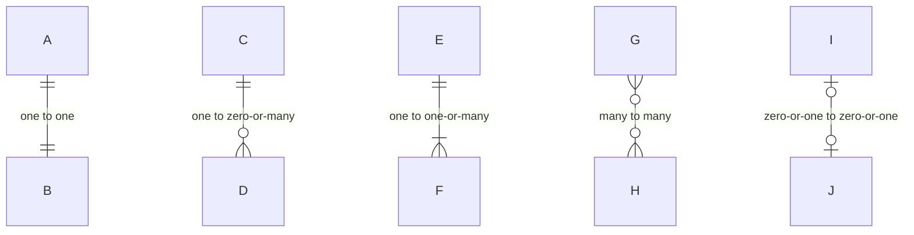

### Common Relationships

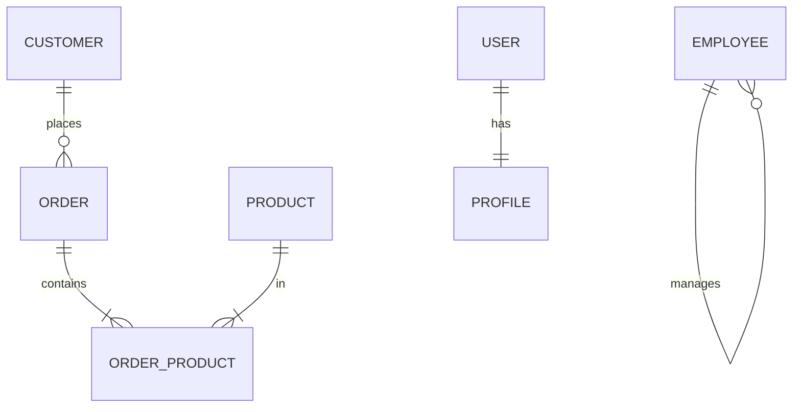

### Identifying Relationships

Use `--` for identifying (solid line) and `..` for non-identifying (dashed line):

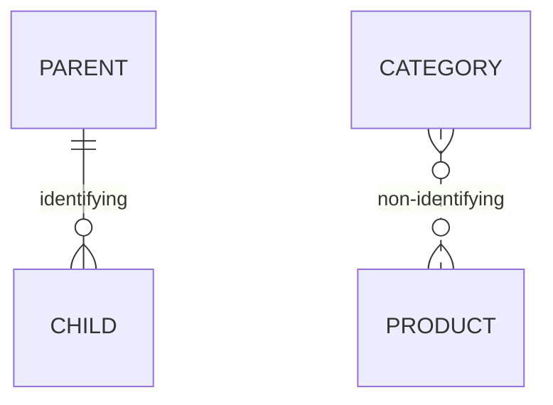

## Relationship Labels

Labels appear after the colon:

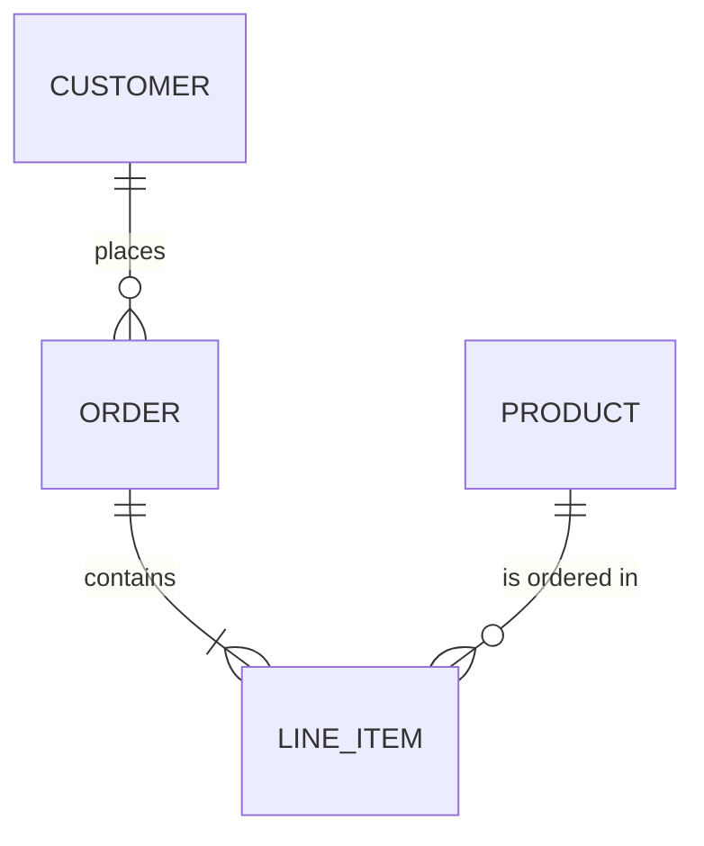

## Complete Example

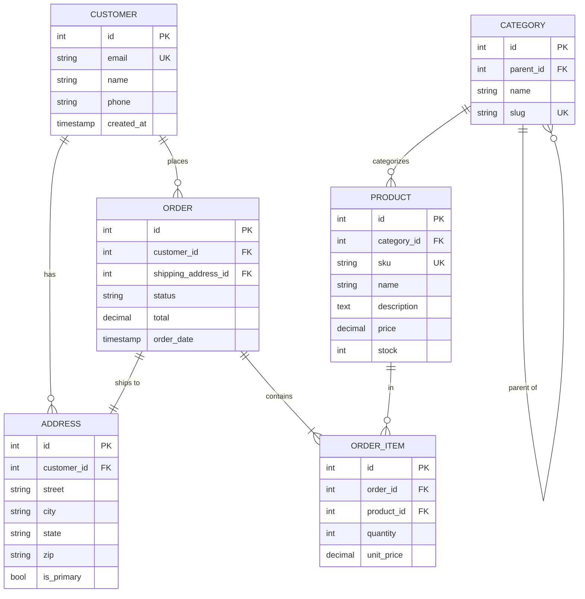

## Common Patterns

### User Authentication

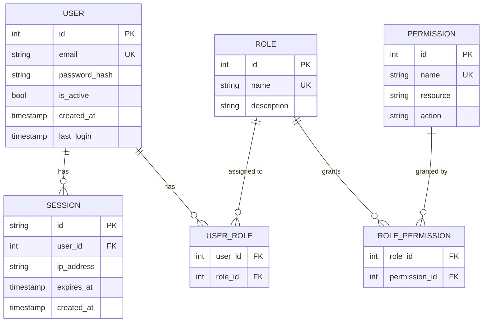

### Blog System

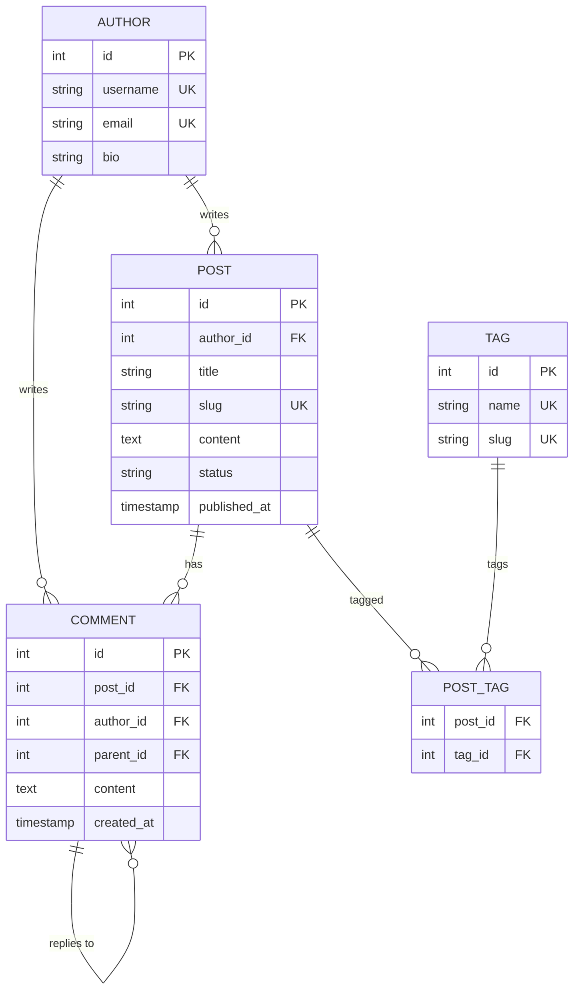

### E-commerce Inventory

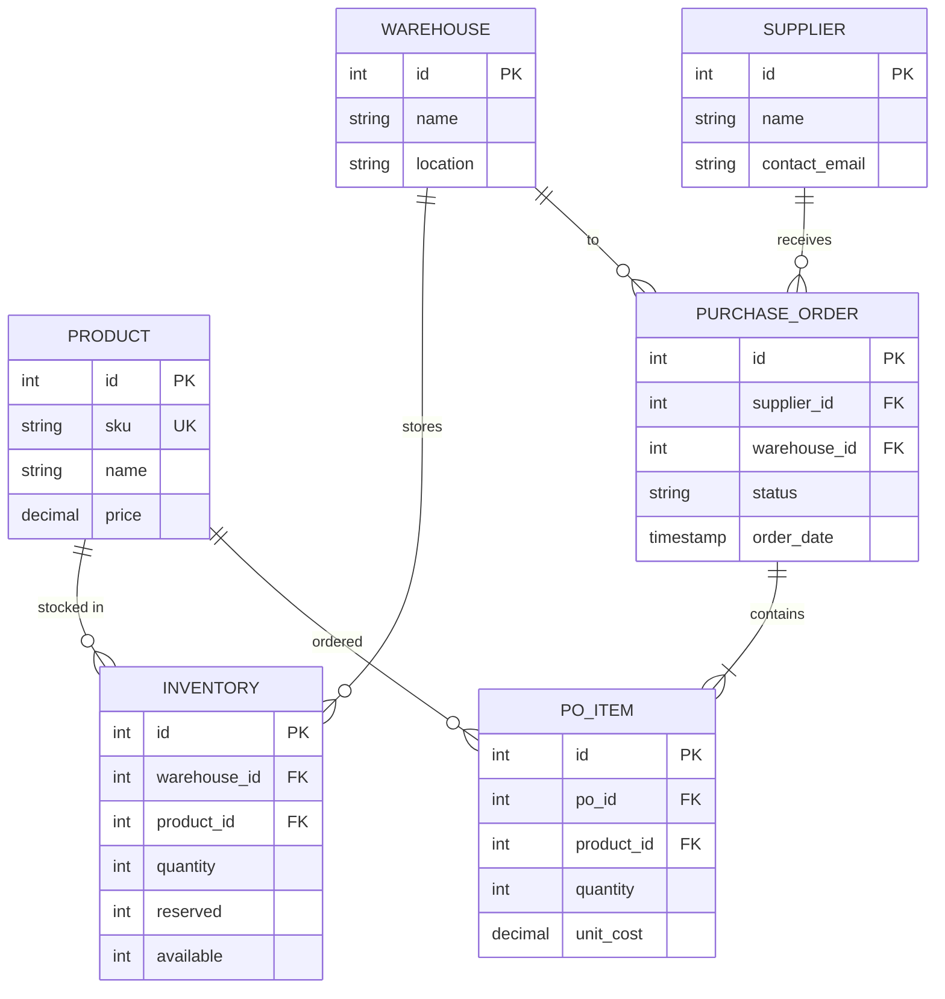

## Tips

1. **Naming**: Use singular nouns for entities (CUSTOMER, not CUSTOMERS)
2. **Primary Keys**: Always define PK for each entity
3. **Foreign Keys**: Mark FK to show relationships
4. **Junction Tables**: Use for many-to-many relationships
5. **Self-References**: Useful for hierarchical data (categories, org charts)
6. **Attribute Order**: Put PK first, then FK, then other attributes
