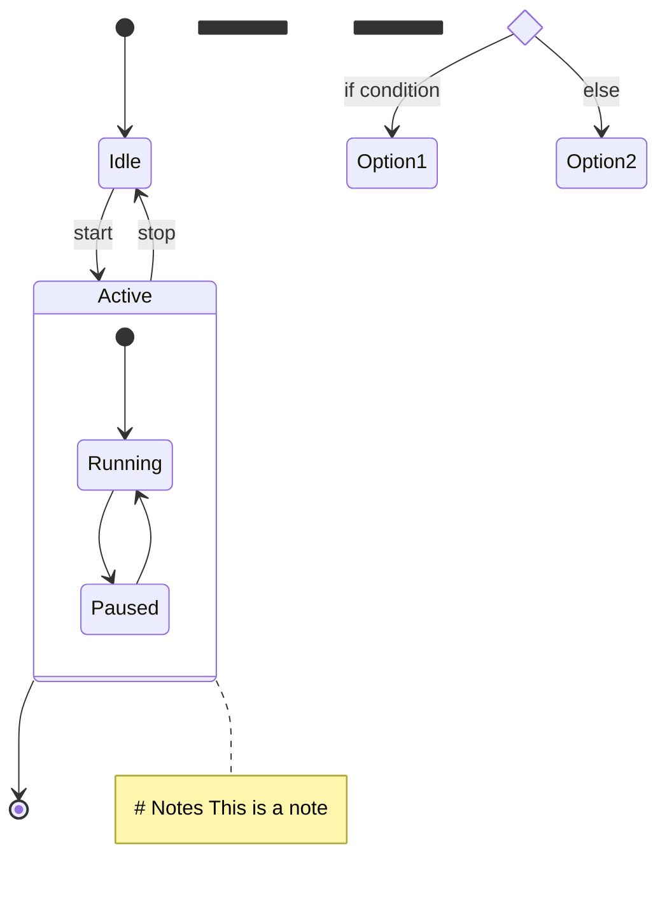
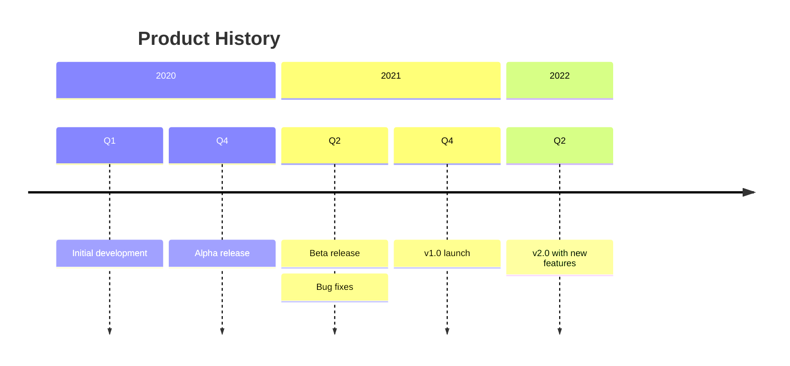
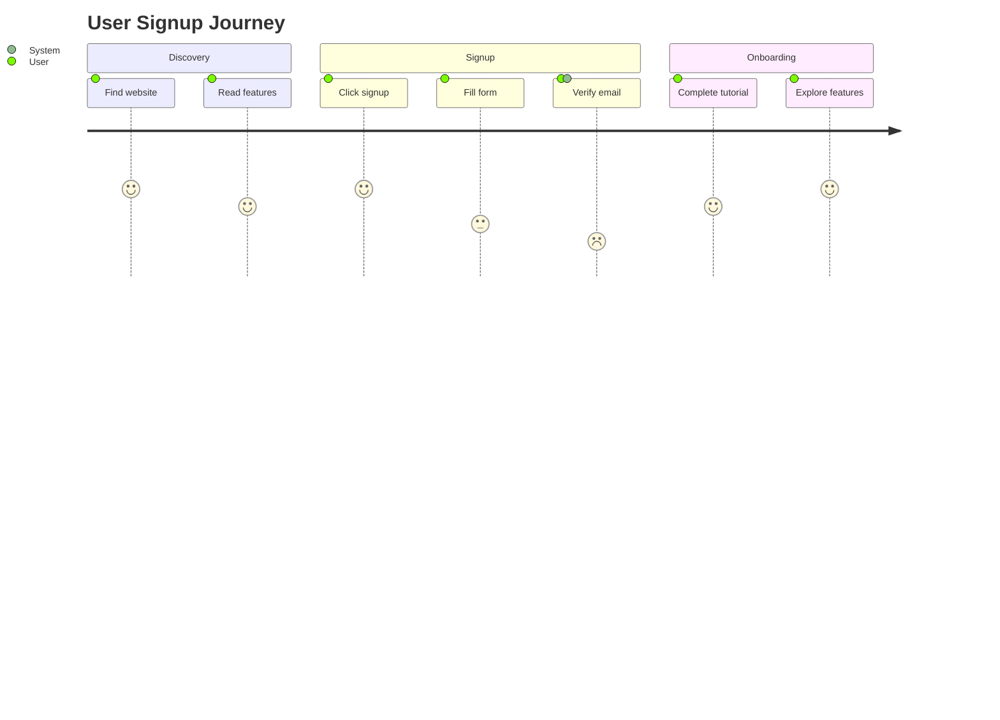
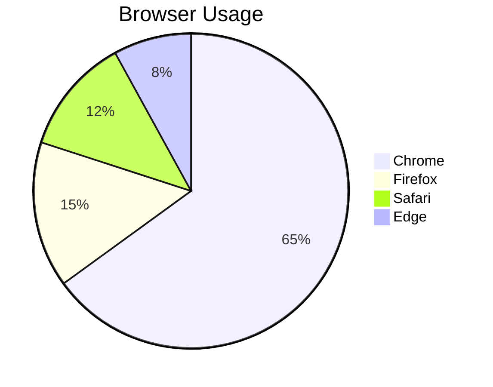
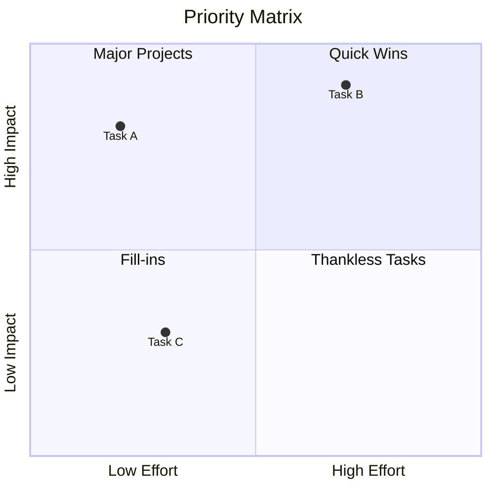
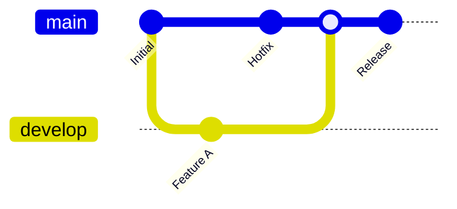
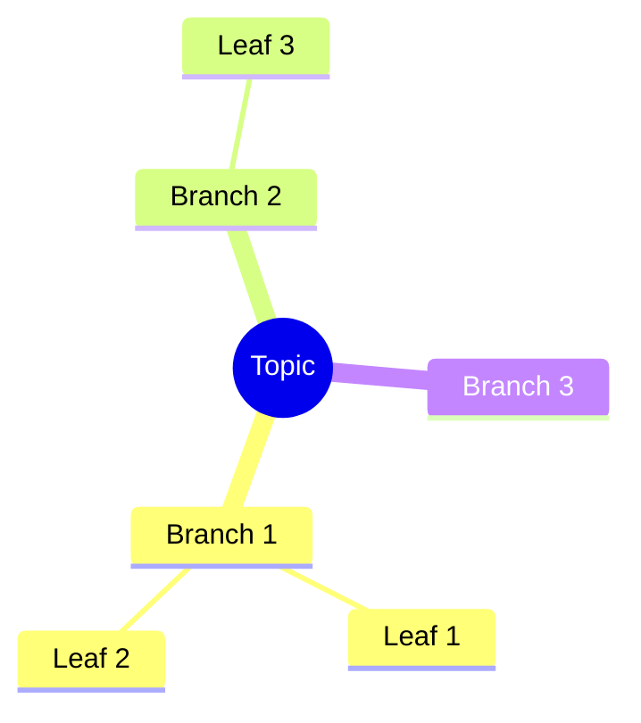
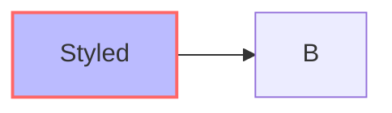

# Mermaid Quick Reference

Compact syntax cheatsheet for all diagram types.

## Flowchart

```mermaid
graph TD           # TD=top-down, LR=left-right, BT=bottom-top, RL=right-left
    A[Rectangle]   # Node shapes
    B(Rounded)
    C{Diamond}
    D([Stadium])
    E[[Subroutine]]
    F[(Database)]
    G((Circle))
    H>Asymmetric]
    I{{Hexagon}}
    J[/Parallelogram/]
    K[\Parallelogram alt\]
    L[/Trapezoid\]
    M[\Trapezoid alt/]

    A --> B        # Links
    B --- C        # Open link
    C -.-> D       # Dotted
    D ==> E        # Thick
    E --text--> F  # With text
    F -->|text| G  # Alt text syntax

    subgraph title # Subgraphs
        H --> I
    end
```

## Sequence Diagram

```mermaid
sequenceDiagram
    participant A as Alice       # Participants
    actor B as Bob              # Actor (stick figure)

    A->>B: Solid line           # Messages
    A-->>B: Dotted line
    A-xB: Cross end
    A-)B: Open arrow

    activate B                  # Activation
    B->>A: Response
    deactivate B

    Note over A,B: Note text    # Notes
    Note right of A: Side note

    loop Every minute           # Loops
        A->>B: Ping
    end

    alt Condition               # Conditionals
        A->>B: Yes
    else Otherwise
        A->>B: No
    end

    opt Optional                # Optional
        A->>B: Maybe
    end

    par Parallel                # Parallel
        A->>B: Task 1
    and
        A->>B: Task 2
    end

    rect rgb(200, 200, 200)     # Highlighting
        A->>B: Highlighted
    end
```

## Class Diagram

```mermaid
classDiagram
    class Animal {              # Class with members
        +String name            # + public
        -int age               # - private
        #String type            # # protected
        ~List~String~ tags     # ~ package/internal
        +eat() void
        +sleep()* void         # * abstract
        +move()$ void          # $ static
    }

    Animal <|-- Dog            # Inheritance
    Dog *-- Tail               # Composition
    Dog o-- Toy                # Aggregation
    Dog --> Owner              # Association
    Dog ..> Food               # Dependency
    Dog ..|> Pet               # Realization

    class Dog {
        <<interface>>          # Annotations
    }

    Dog "1" --> "*" Toy        # Cardinality
```

## State Diagram



## ER Diagram

```mermaid
erDiagram
    CUSTOMER ||--o{ ORDER : places     # Relationships
    # ||  exactly one
    # o|  zero or one
    # }|  one or more
    # }o  zero or more

    CUSTOMER {                          # Attributes
        int id PK                       # Primary key
        string email UK                 # Unique key
        string name
    }
    ORDER {
        int id PK
        int customer_id FK              # Foreign key
        date created_at
    }
```

## C4 Diagram

```mermaid
C4Context                              # Levels: C4Context, C4Container, C4Component
    title System Context

    Person(user, "User", "Description")
    System(sys, "System", "Description")
    System_Ext(ext, "External", "Description")
    SystemDb(db, "Database", "Description")
    SystemQueue(queue, "Queue", "Description")

    System_Boundary(boundary, "Boundary Title") {
        System(inner, "Inner System")
    }

    Rel(user, sys, "Uses", "HTTPS")    # Relationships
    Rel_L(sys, db, "Reads")            # Direction: L/R/U/D
    BiRel(sys, ext, "Syncs")           # Bidirectional
```

## Gantt Chart

```mermaid
gantt
    title Project Plan
    dateFormat YYYY-MM-DD
    excludes weekends                   # Exclude days

    section Phase 1
    Task 1 :a1, 2024-01-01, 30d        # id, start, duration
    Task 2 :a2, after a1, 20d          # after dependency
    Milestone :milestone, m1, 2024-02-20, 0d

    section Phase 2
    Task 3 :crit, 2024-02-01, 15d      # Critical path
    Task 4 :active, a4, after a2, 10d  # Active task
    Task 5 :done, 2024-01-15, 5d       # Completed
```

## Timeline



## User Journey



## Pie Chart



## Quadrant Chart



## Git Graph



## Mindmap



## Styling

### Inline Styles



### Theme Configuration

```json
{
  "theme": "dark",
  "themeVariables": {
    "primaryColor": "#BB2528",
    "edgeLabelBackground": "#fff"
  }
}
```

## Special Characters

- Use `#quot;` for double quotes
- Use `#semi;` for semicolons
- Use `<br/>` for line breaks in labels
- Wrap text in quotes for spaces: `A["Text with spaces"]`
