# State Diagram Reference

State diagrams model state machines with states, transitions, and events.

## Basic Syntax

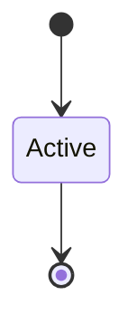

Use `stateDiagram-v2` for the modern syntax (recommended).

## States

### Simple States

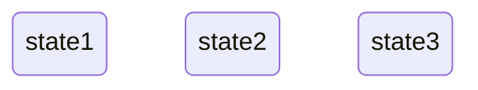

### States with Descriptions

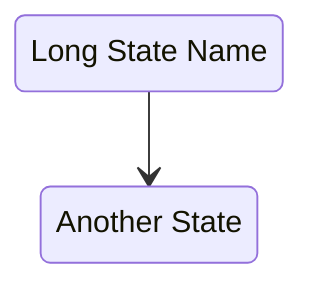

### Initial and Final States

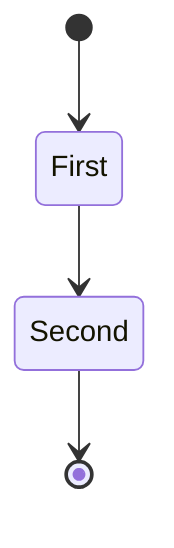

## Transitions

### Basic Transitions

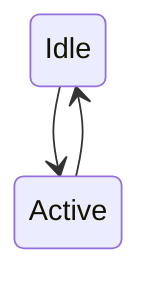

### Transitions with Labels

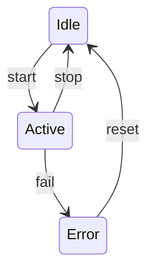

### Self-Transitions

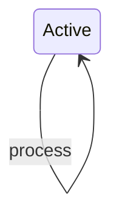

## Composite States

### Nested States

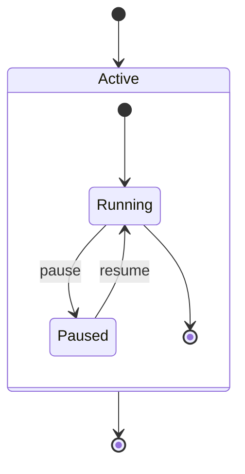

### Deeply Nested

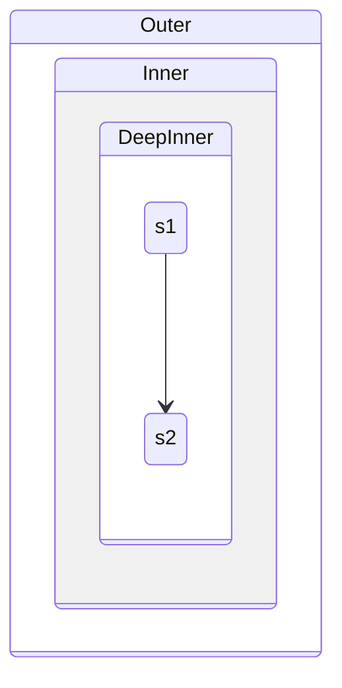

## Fork and Join

### Parallel States

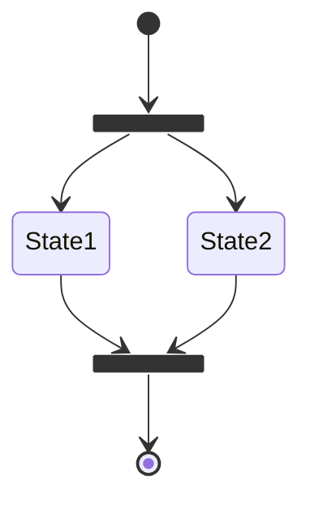

## Choice (Conditional)

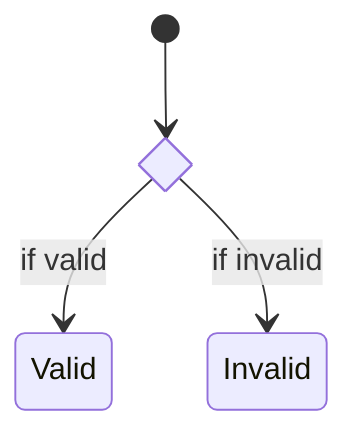

### Complex Choice

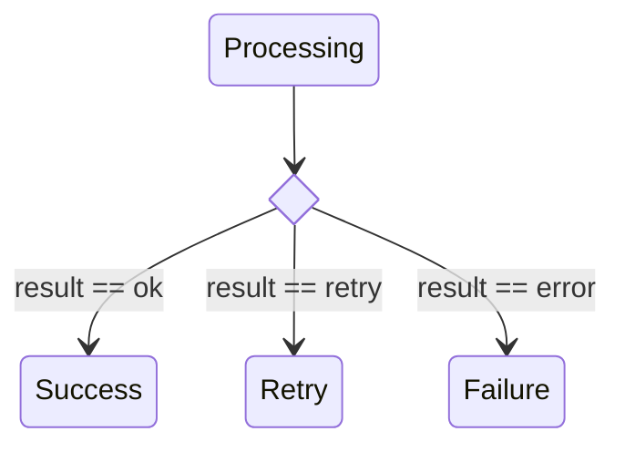

## Notes

### Note Positioning

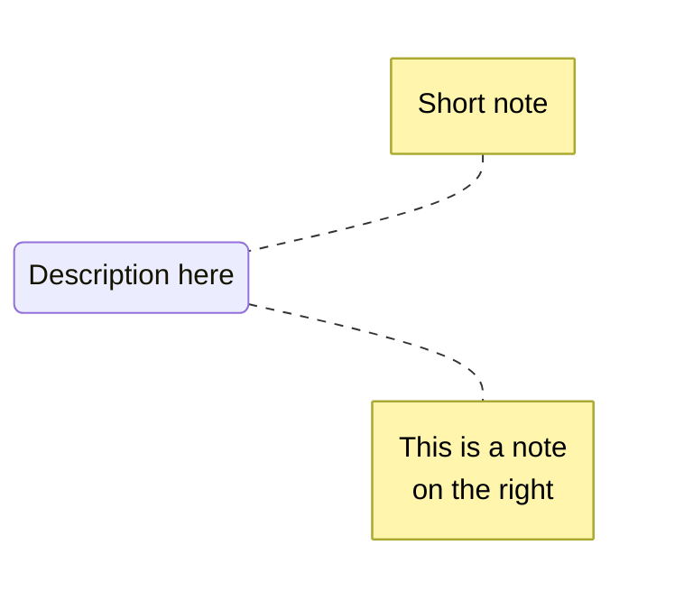

### Notes on Transitions

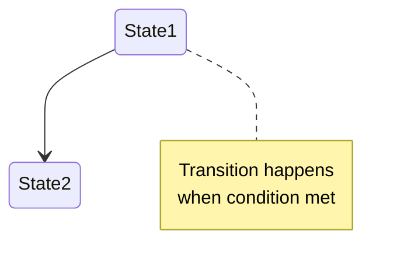

## Concurrency

### Concurrent Regions

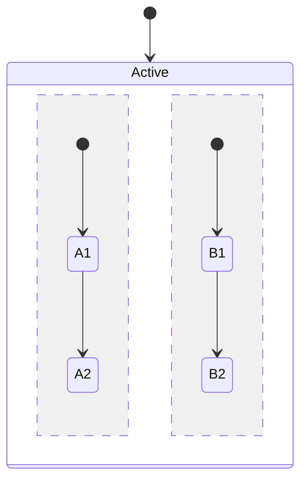

## Direction

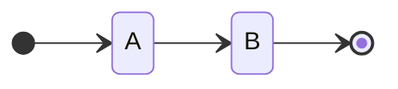

Options: `LR`, `RL`, `TB`, `BT`

## Styling

### State Styling

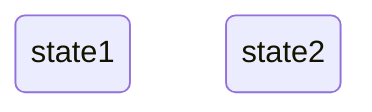

## Complete Example

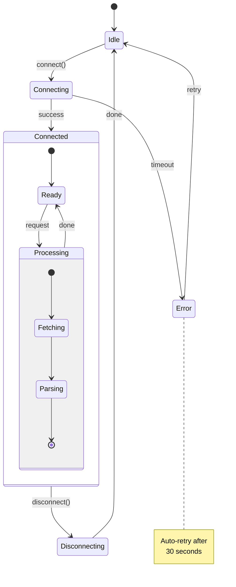

## Common Patterns

### Order Status

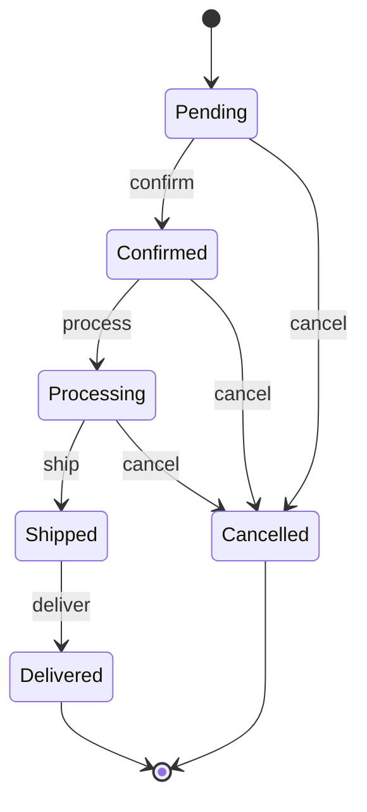

### Authentication State

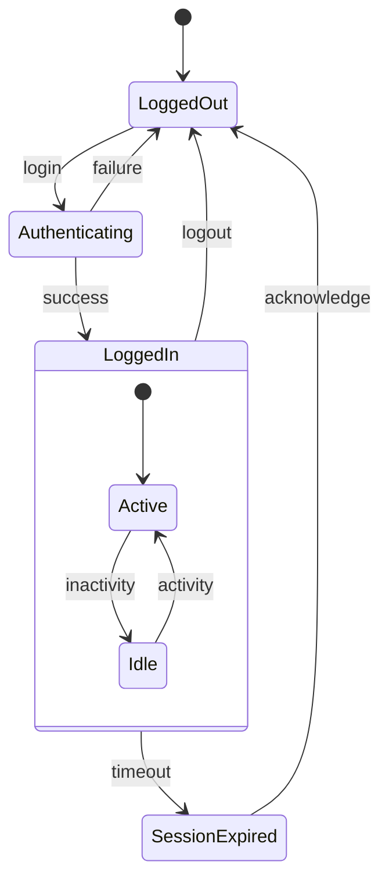

### Document Workflow

```mermaid
stateDiagram-v2
    [*] --> Draft

    Draft --> Review : submit
    Review --> Draft : reject
    Review --> Approved : approve

    state Review {
        [*] --> TechnicalReview
        TechnicalReview --> LegalReview
        LegalReview --> [*]
    }

    Approved --> Published : publish
    Published --> Archived : archive
    Archived --> [*]

    note right of Review
        Both reviews must
        pass before approval
    end note
```

### Connection State Machine

```mermaid
stateDiagram-v2
    [*] --> Disconnected

    Disconnected --> Connecting : connect

    state Connecting {
        [*] --> ResolvingDNS
        ResolvingDNS --> EstablishingTCP
        EstablishingTCP --> Handshaking
        Handshaking --> [*]
    }

    Connecting --> Connected : success
    Connecting --> Disconnected : failure

    Connected --> Disconnecting : disconnect
    Connected --> Reconnecting : error

    Reconnecting --> Connected : success
    Reconnecting --> Disconnected : max_retries

    Disconnecting --> Disconnected : done
```

### Traffic Light

```mermaid
stateDiagram-v2
    [*] --> Red
    Red --> Green : timer(30s)
    Green --> Yellow : timer(25s)
    Yellow --> Red : timer(5s)

    note right of Red : Stop
    note right of Yellow : Caution
    note right of Green : Go
```
