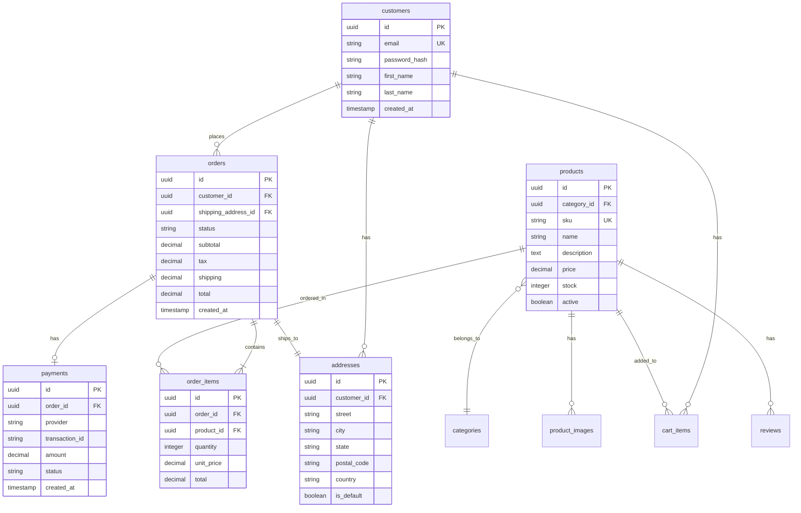

# Mermaid Examples

Real-world diagram patterns for common use cases.

## API Documentation

### REST API Flow

### OAuth 2.0 Authorization Code Flow

## System Architecture

### Microservices Architecture

### Event-Driven Architecture

## Database Design

### E-Commerce Schema

## CI/CD Pipelines

### GitHub Actions Workflow

### Multi-Environment Deployment

## State Machines

### Order Status

### Authentication Flow

## Process Flows

### User Registration

### Checkout Process

## Project Management

### Sprint Planning

### Feature Roadmap

## Class Diagrams

### Domain Model

### Repository Pattern

