# Gantt Chart Reference

Gantt charts visualize project schedules, tasks, and dependencies.

## Basic Syntax

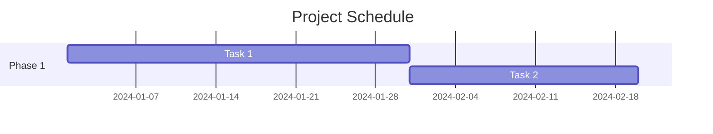

## Date Formats

### Input Format

```mermaid
gantt
    dateFormat YYYY-MM-DD
```

Common formats:
| Format | Example |
|--------|---------|
| `YYYY-MM-DD` | 2024-01-15 |
| `DD-MM-YYYY` | 15-01-2024 |
| `YYYY-MM-DDTHH:mm` | 2024-01-15T14:30 |

### Display Format

```mermaid
gantt
    dateFormat YYYY-MM-DD
    axisFormat %b %d    %% Jan 15
```

Axis format codes:
| Code | Output |
|------|--------|
| `%Y` | 2024 |
| `%y` | 24 |
| `%m` | 01 |
| `%b` | Jan |
| `%B` | January |
| `%d` | 15 |
| `%a` | Mon |
| `%A` | Monday |
| `%H` | 14 |
| `%M` | 30 |

## Sections

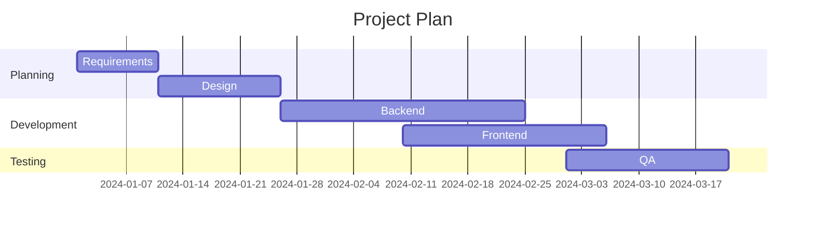

## Task Definition

### Basic Task

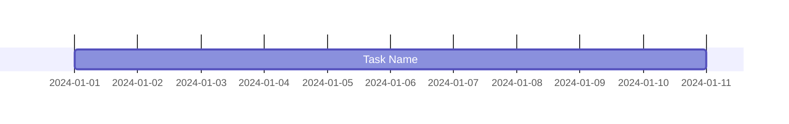

### Task with ID


### Duration Options

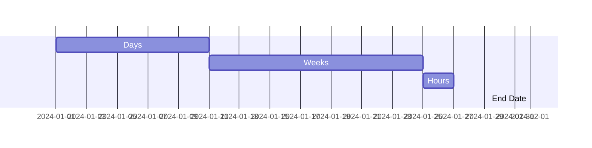

## Dependencies

### After Dependency

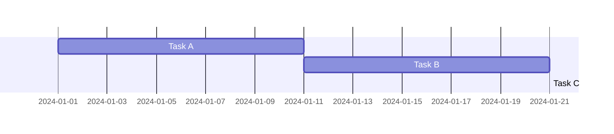

### Parallel Tasks

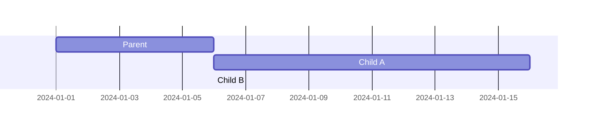

## Task States

### Status Markers

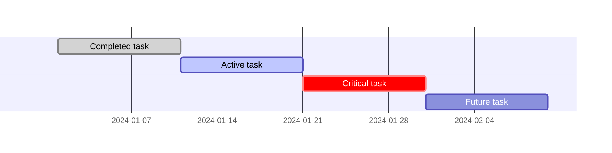

### Combined States

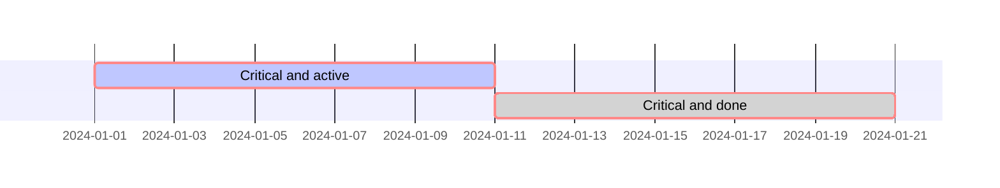

## Milestones

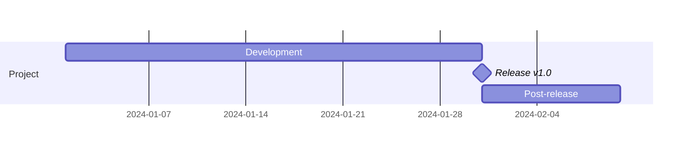

## Excluding Days

### Weekends

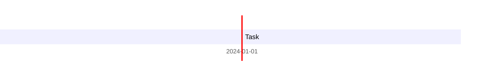

### Specific Days

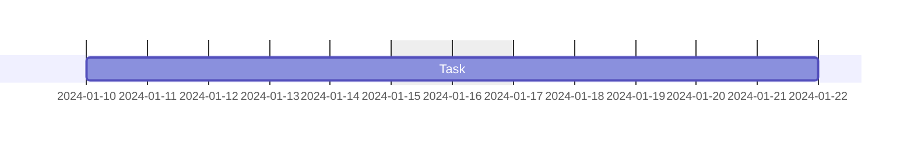

### Multiple Exclusions

```mermaid
gantt
    excludes weekends, 2024-12-25, 2024-12-26
```

## Tick Interval

Control axis tick spacing:

```mermaid
gantt
    tickInterval 1week
    %% Options: 1day, 1week, 1month
```

## Today Marker

```mermaid
gantt
    todayMarker on    %% Shows current date line
    %% todayMarker off to hide
```

## Complete Example

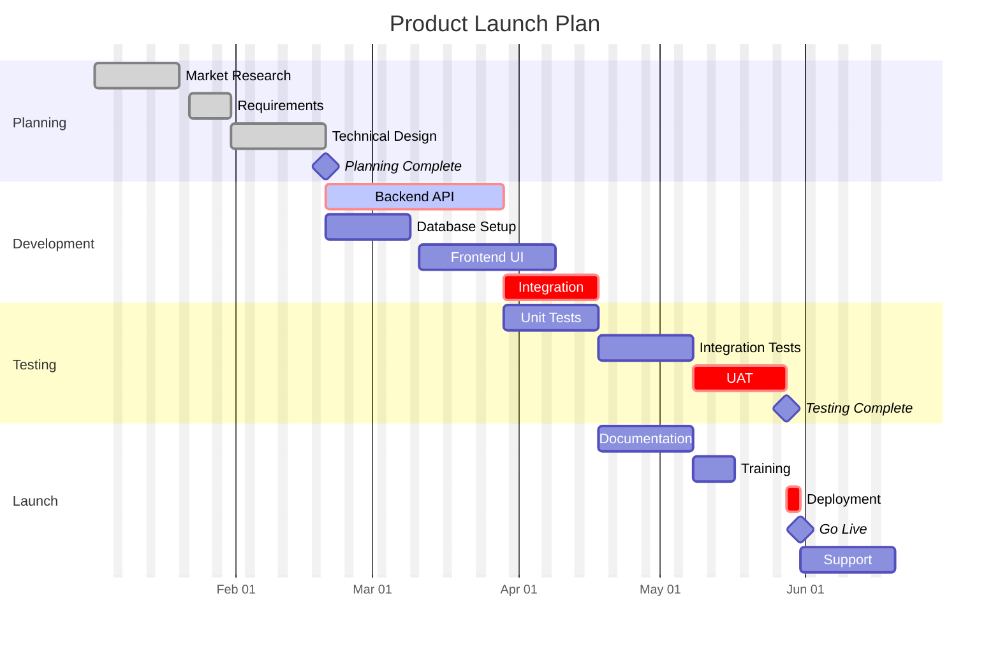

## Common Patterns

### Sprint Planning

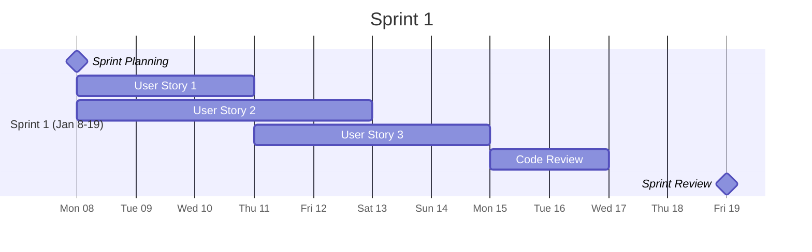

### Release Timeline

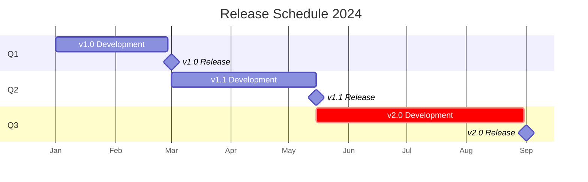

### Waterfall Project

```mermaid
gantt
    title Waterfall Project
    dateFormat YYYY-MM-DD

    section Analysis
    Requirements :req, 2024-01-01, 30d
    Sign-off :milestone, after req, 0d

    section Design
    System Design :des, after req, 20d
    Detail Design :after des, 15d
    Design Review :milestone, 2024-03-05, 0d

    section Implementation
    Development :crit, dev, 2024-03-06, 60d
    Code Complete :milestone, after dev, 0d

    section Testing
    System Test :test, after dev, 20d
    UAT :uat, after test, 15d
    Go Live :milestone, after uat, 0d
```

### Parallel Workstreams

```mermaid
gantt
    title Parallel Development
    dateFormat YYYY-MM-DD

    section Backend
    API Design :api_design, 2024-01-01, 10d
    API Development :api_dev, after api_design, 30d
    API Testing :api_test, after api_dev, 10d

    section Frontend
    UI Design :ui_design, 2024-01-01, 15d
    UI Development :ui_dev, after ui_design, 25d
    UI Testing :ui_test, after ui_dev, 10d

    section Integration
    Integration :crit, after api_dev ui_dev, 10d
    E2E Testing :crit, after integration, 10d
    Release :milestone, crit, after E2E Testing, 0d
```

## Tips

1. **Use IDs**: Assign IDs to tasks for dependencies
2. **Exclude Weekends**: Add `excludes weekends` for realistic timelines
3. **Milestones**: Use 0d duration for milestone markers
4. **Critical Path**: Mark `crit` on blocking tasks
5. **Active Tasks**: Use `active` to highlight current work
6. **Sections**: Group related tasks for clarity
7. **Axis Format**: Customize date display for readability
