# User Journey Reference

User journey diagrams map user experiences with satisfaction scores.

## Basic Syntax

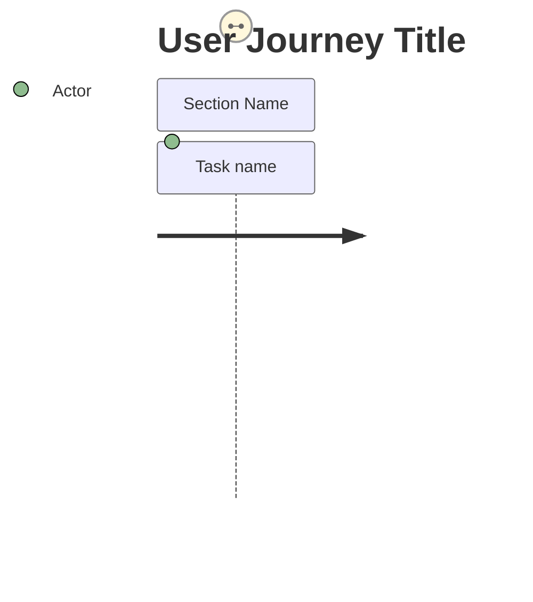

## Structure

### Title


### Sections

Sections group related tasks in the journey:

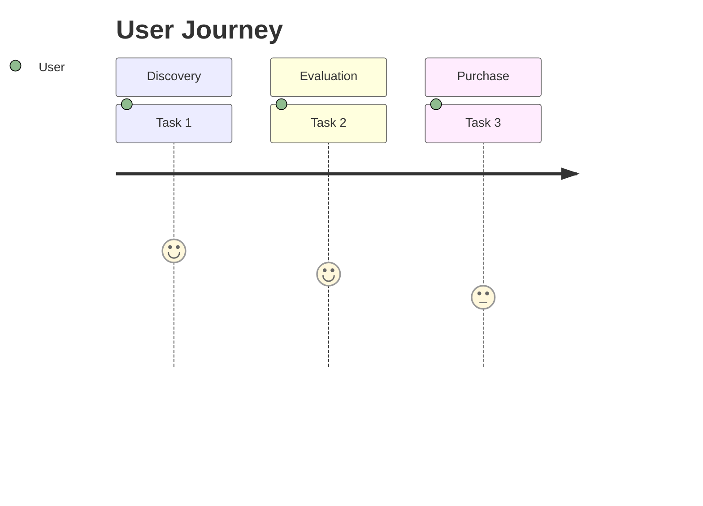

## Tasks

### Task Format

```
Task description: satisfaction_score: Actor1, Actor2
```

### Satisfaction Scores

Scores range from 0-5:

| Score | Meaning |
|-------|---------|
| 0 | Very negative |
| 1 | Negative |
| 2 | Somewhat negative |
| 3 | Neutral |
| 4 | Positive |
| 5 | Very positive |

### Score Examples

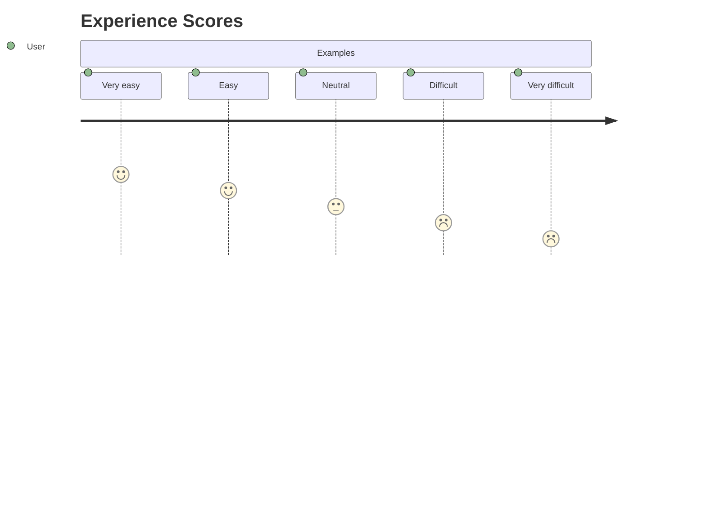

## Actors

### Single Actor

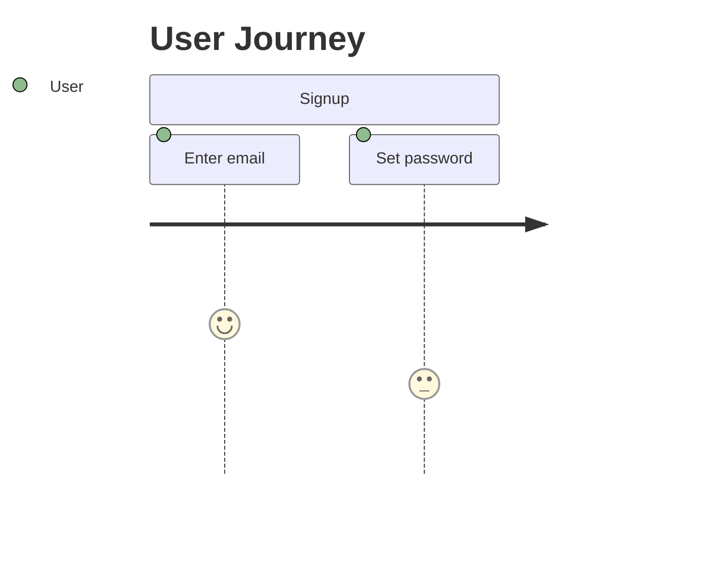

### Multiple Actors

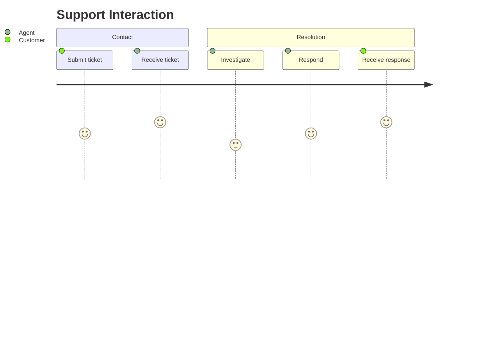

## Complete Examples

### E-commerce Purchase

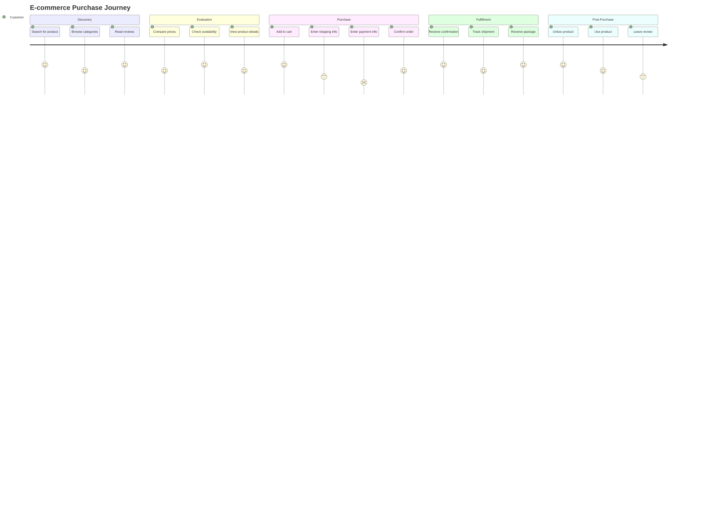

### SaaS Onboarding

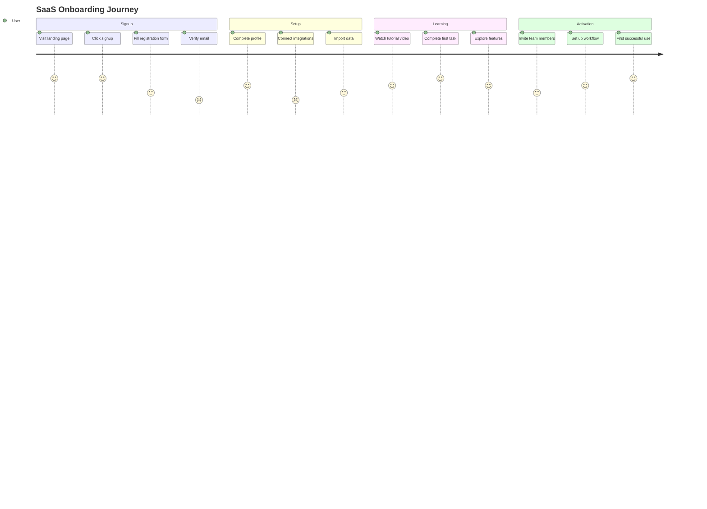

### Customer Support

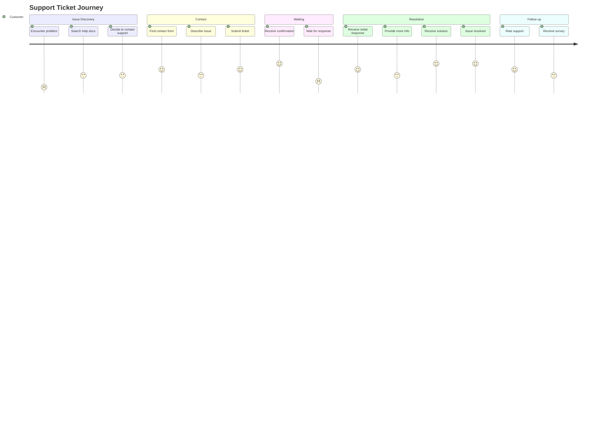

### Mobile App First Use

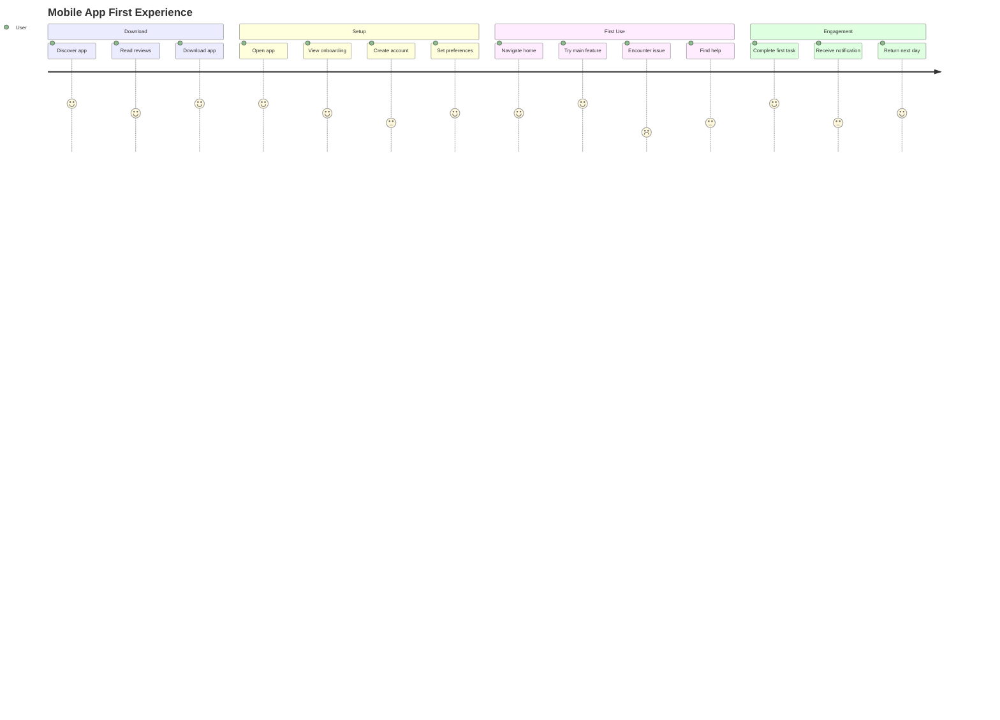

### Multi-Actor Journey

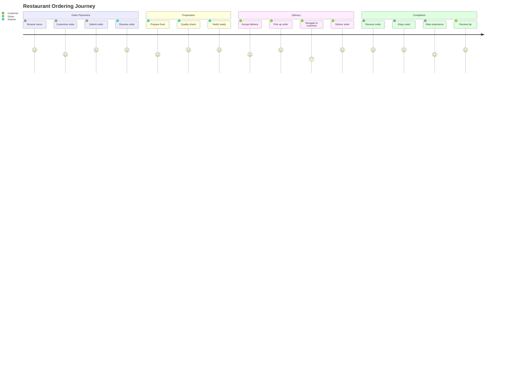

### B2B Sales Journey

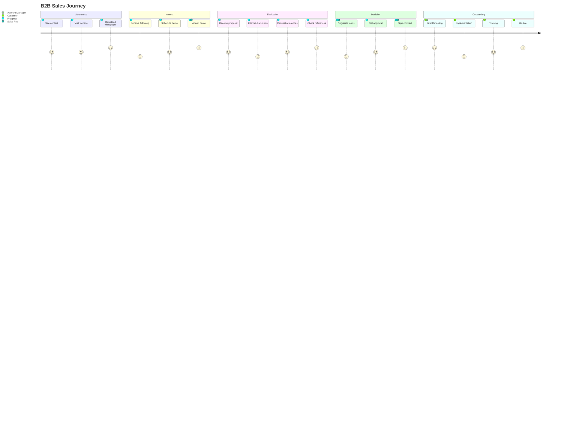

## Identifying Pain Points

Low scores highlight friction:

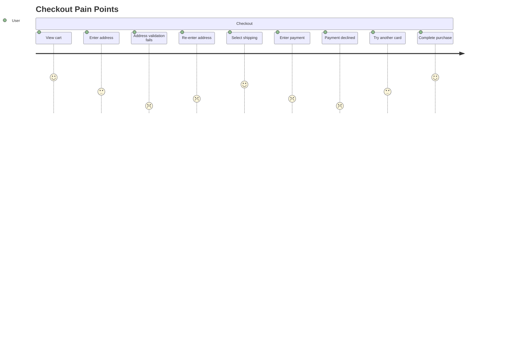

## Tips

1. **Focus on Key Steps**: Include significant touchpoints, not every action
2. **Honest Scores**: Use realistic satisfaction levels to identify issues
3. **Multiple Actors**: Show handoffs between roles/systems
4. **Sections**: Group by phase, channel, or time period
5. **Identify Friction**: Low scores reveal improvement opportunities
6. **Tell a Story**: Order tasks chronologically
7. **Include Context**: Task descriptions should be self-explanatory
