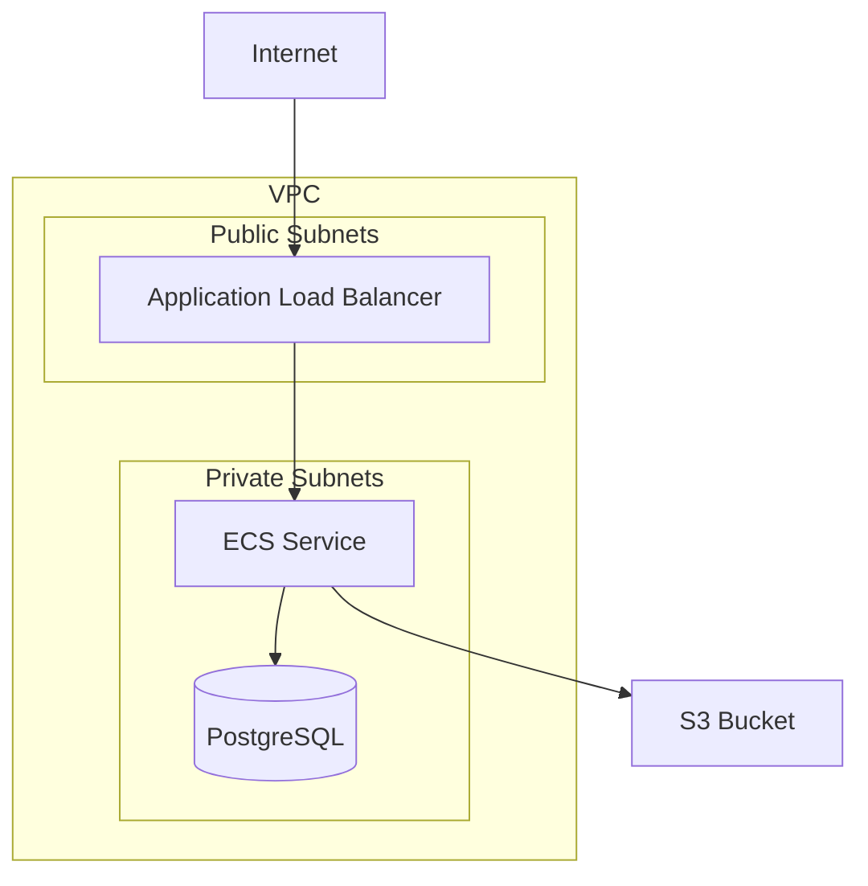

# Documentation Patterns

## Contents
- [terraform-docs](#terraform-docs) - Installation, configuration, pre-commit
- [Diagram as Code](#diagram-as-code) - Diagrams (Python), Mermaid, terraform graph, Inframap
- [Architecture Decision Records](#architecture-decision-records-adrs) - Template, index, tools
- [Module README Template](#module-readme-template) - Standard module documentation
- [Project README Template](#project-readme-template) - Project documentation
- [Documentation Anti-patterns](#documentation-anti-patterns) - Common mistakes

## terraform-docs

### Installation

```bash
# macOS
brew install terraform-docs

# Linux
curl -Lo ./terraform-docs.tar.gz https://github.com/terraform-docs/terraform-docs/releases/download/v0.17.0/terraform-docs-v0.17.0-linux-amd64.tar.gz
tar -xzf terraform-docs.tar.gz
chmod +x terraform-docs
mv terraform-docs /usr/local/bin/
```

### Configuration

`.terraform-docs.yml`:
```yaml
formatter: "markdown table"

version: ""

header-from: main.tf
footer-from: ""

recursive:
  enabled: false
  path: modules

sections:
  hide: []
  show: []

content: |-
  {{ .Header }}

  ## Usage

  ```hcl
  module "example" {
    source = "git::https://github.com/org/modules.git//{{ .Module.Name }}"

    # Required
    name = "my-resource"

    # Optional
    tags = {}
  }
  ```

  {{ .Requirements }}

  {{ .Providers }}

  {{ .Modules }}

  {{ .Resources }}

  {{ .Inputs }}

  {{ .Outputs }}

output:
  file: README.md
  mode: inject
  template: |-
    <!-- BEGIN_TF_DOCS -->
    {{ .Content }}
    <!-- END_TF_DOCS -->

output-values:
  enabled: false
  from: ""

sort:
  enabled: true
  by: name

settings:
  anchor: true
  color: true
  default: true
  description: true
  escape: true
  hide-empty: false
  html: true
  indent: 2
  lockfile: true
  read-comments: true
  required: true
  sensitive: true
  type: true
```

### Generate Docs

```bash
# Single module
terraform-docs markdown table ./modules/vpc

# Inject into README
terraform-docs markdown table --output-file README.md --output-mode inject ./modules/vpc

# All modules
for dir in modules/*/; do
  terraform-docs markdown table --output-file README.md --output-mode inject "$dir"
done
```

### Pre-commit Hook

`.pre-commit-config.yaml`:
```yaml
repos:
  - repo: https://github.com/terraform-docs/terraform-docs
    rev: v0.17.0
    hooks:
      - id: terraform-docs-go
        args: ["--output-file", "README.md", "--output-mode", "inject"]
```

## Diagram as Code

### Diagrams (Python)

```python
# diagrams/architecture.py
from diagrams import Cluster, Diagram
from diagrams.aws.compute import EC2, ECS
from diagrams.aws.database import RDS
from diagrams.aws.network import ELB, VPC, PublicSubnet, PrivateSubnet
from diagrams.aws.storage import S3

with Diagram("AWS Architecture", show=False, direction="TB"):
    with Cluster("VPC"):
        with Cluster("Public Subnets"):
            alb = ELB("ALB")

        with Cluster("Private Subnets"):
            with Cluster("ECS Cluster"):
                ecs = [ECS("service-1"), ECS("service-2")]

            with Cluster("Database"):
                db = RDS("PostgreSQL")

    s3 = S3("Assets")

    alb >> ecs >> db
    ecs >> s3
```

Generate:
```bash
pip install diagrams
python diagrams/architecture.py
```

### Mermaid

```markdown
# In README.md


```

### Terraform Graph

```bash
# Generate DOT format
terraform graph > graph.dot

# Convert to image
terraform graph | dot -Tpng > graph.png

# Filter to specific resources
terraform graph -type=plan | dot -Tsvg > plan.svg
```

### Inframap

```bash
# Install
go install github.com/cycloidio/inframap@latest

# Generate from state
inframap generate --tfstate terraform.tfstate | dot -Tpng > infrastructure.png

# From HCL
inframap generate --hcl . | dot -Tsvg > infrastructure.svg
```

## Architecture Decision Records (ADRs)

### ADR Template

`docs/adr/0001-use-terraform-for-iac.md`:
```markdown
# ADR 0001: Use Terraform for Infrastructure as Code

## Status

Accepted

## Context

We need to manage cloud infrastructure as code. Options considered:
- Terraform/OpenTofu
- Pulumi
- AWS CDK
- CloudFormation

## Decision

Use Terraform with the following rationale:
- Team has existing Terraform experience
- Largest provider ecosystem
- HCL is purpose-built for infrastructure
- Strong community and documentation

## Consequences

### Positive
- Consistent infrastructure management
- Version-controlled infrastructure changes
- Plan before apply workflow

### Negative
- Learning curve for new team members
- State management complexity
- HCL limitations for complex logic

### Neutral
- Need to establish module standards
- CI/CD pipeline required
```

### ADR Index

`docs/adr/README.md`:
```markdown
# Architecture Decision Records

| ADR | Title | Status | Date |
|-----|-------|--------|------|
| [0001](0001-use-terraform-for-iac.md) | Use Terraform for IaC | Accepted | 2024-01-15 |
| [0002](0002-state-backend-s3.md) | S3 Backend for State | Accepted | 2024-01-16 |
| [0003](0003-module-versioning.md) | Semantic Versioning for Modules | Accepted | 2024-01-20 |
| [0004](0004-env-structure.md) | Directory-based Environments | Accepted | 2024-02-01 |
```

### ADR Tools

```bash
# Install adr-tools
brew install adr-tools

# Initialize ADR directory
adr init docs/adr

# Create new ADR
adr new "Use S3 for State Backend"

# Supersede an ADR
adr new -s 1 "Use Terraform Cloud Instead of S3"
```

## Module README Template

```markdown
# Module Name

Brief description of what this module creates.

## Usage

```hcl
module "example" {
  source  = "git::https://github.com/org/modules.git//module-name?ref=v1.0.0"

  name        = "my-resource"
  environment = "prod"

  tags = {
    Owner = "platform-team"
  }
}
```

## Examples

- [Basic](examples/basic) - Minimal configuration
- [Complete](examples/complete) - Full configuration with all options

## Requirements

| Name | Version |
|------|---------|
| terraform | >= 1.5.0 |
| aws | >= 5.0 |

## Providers

| Name | Version |
|------|---------|
| aws | >= 5.0 |

## Resources

| Name | Type |
|------|------|
| aws_vpc.this | resource |
| aws_subnet.private | resource |

## Inputs

| Name | Description | Type | Default | Required |
|------|-------------|------|---------|:--------:|
| name | Name prefix for resources | `string` | n/a | yes |
| environment | Environment name | `string` | n/a | yes |
| cidr | VPC CIDR block | `string` | `"10.0.0.0/16"` | no |

## Outputs

| Name | Description |
|------|-------------|
| vpc_id | The VPC ID |
| private_subnet_ids | List of private subnet IDs |

## License

MIT
```

## Project README Template

```markdown
# Infrastructure

Infrastructure as Code for [Project Name].

## Prerequisites

- Terraform >= 1.5.0
- AWS CLI configured
- Access to AWS account

## Structure

```
.
├── environments/
│   ├── dev/
│   ├── staging/
│   └── prod/
├── modules/
│   ├── networking/
│   ├── compute/
│   └── database/
└── docs/
    ├── adr/
    └── diagrams/
```

## Quick Start

```bash
# Initialize
cd environments/dev
terraform init

# Plan
terraform plan

# Apply
terraform apply
```

## Environments

| Environment | Account | Region |
|-------------|---------|--------|
| dev | 111111111111 | us-east-1 |
| staging | 222222222222 | us-east-1 |
| prod | 333333333333 | us-east-1 |

## Modules

| Module | Description | Version |
|--------|-------------|---------|
| networking | VPC, subnets, NAT | v1.2.0 |
| compute | ECS, ALB | v1.1.0 |
| database | RDS PostgreSQL | v1.0.0 |

## CI/CD

- PR → Plan → Review → Merge
- Merge to main → Apply to staging
- Tag release → Apply to prod

## Documentation

- [Architecture Diagrams](docs/diagrams/)
- [ADRs](docs/adr/)
```

## Documentation Anti-patterns

| Anti-pattern | Problem | Fix |
|--------------|---------|-----|
| Manual README | Gets stale | Use terraform-docs |
| No diagrams | Hard to understand | Add diagram-as-code |
| No ADRs | Lost context | Document decisions |
| No examples | Hard to use | Add example configs |
| Outdated docs | Misleading | Automate in CI |
